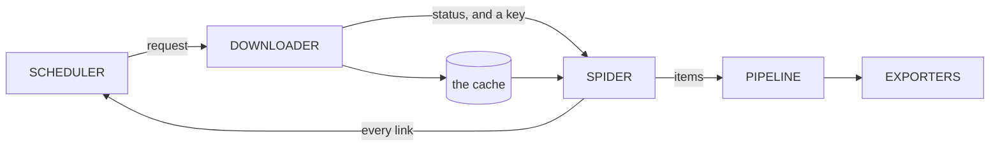

# scour

A focused web crawler that ranks links by how likely they are to hold what you
asked for.

An exhaustive crawler can use a queue: it is going everywhere anyway and only
the order changes. A focused crawler is choosing what *not* to fetch, and that
choice is the whole design. The parts are borrowed from Scrapy; what differs is
that they are services talking over NATS rather than objects calling each other,
and that a job brings its own engine with it.



Four stages and the exporters at the end. Only one arrow points backwards, and
it is the one that makes a focused crawl focused: every link a spider finds goes
back to the scheduler, which decides what comes out next.

## Start here

A job is one HCL document. It carries its own engine configuration, so a job
resubmitted next month does what it did today.

```console
$ scour job init news > news.hcl
$ scour job valid news.hcl
news.hcl: ok, 1 job(s): news

$ scour scrape news.hcl            # one page, cached, showing what each property found
$ scour crawl news.hcl             # the whole crawl, in this process, no server
$ scour job train --file news.hcl  # read the cache, propose locators, write them back
```

`scour crawl` is not a demonstration mode. It is the same four stages the cluster
wires over the bus, wired directly instead, and a test holds one job to
producing the same records either way. A laptop is a complete deployment.

When one machine is not enough, the same document goes to a cluster. A server
is a node serving stages and the job service that drives the crawls; the job
service owns the frontier and asks the nodes to fetch and read.

```console
$ scour server                      # a broker, a node and the job service
$ scour cluster join nats://...     # remembered, so nothing else needs the address
$ scour job create news.hcl
$ scour job start news
$ scour job watch news
18:22:06  running  fetched 12  items 9  exported 0  queued 47
18:22:34  done     finished
```

## The book

[**docs/**](docs/) is the design, in ten chapters. Every claim in them
is checked against the code by a test, so a chapter that drifts fails the build
rather than misleading somebody quietly.

| | Chapter | |
| --- | --- | --- |
| **Start** | [One document, everything in it](docs/job/index.md) | An HCL job carries its own engine |
| **Fetching** | [Chains run both ways](docs/chains/index.md) | Middleware wraps a stage, both directions |
| | [Fetching, politely](docs/downloader/index.md) | One request, inside what a site asked for |
| | [The cache is the corpus](docs/cache/index.md) | Bodies are kept because fetching is the expensive part |
| **Choosing** | [What to fetch next](docs/frontier/index.md) | The queue is the crawler |
| **Extracting** | [Shapes, entities, measurements](docs/items/index.md) | What is extracted, and what it refers to |
| | [A graph, not a list](docs/pipeline/index.md) | Steps run when what they require has run |
| **Running it** | [Local until it has to be shared](docs/cli/index.md) | Eight commands, and what each one needs |
| | [Where everything lives](docs/storage/index.md) | Eleven stores, each with one owner |

## Building it

```console
$ go build ./cmd/scour
$ go test ./...
```

Go 1.25 or newer, and no cgo: `CGO_ENABLED=0 go build ./...` is what the gate
runs. A single node needs nothing installed, because the broker is embedded and
the stores are SQLite files a crawl opens only if it asks for them.

## Where this is

All four stages are built and tested, and so is the bus between them. A crawl
now runs across the cluster: the job service holds the frontier, drives the
loop, and reads a resubmission through the job's own `mutation` policy before
applying it to something already running.

What is missing is `plan`: the engine computes a diff with an effect per change,
and `job update` acts on its verdict, but nothing yet prints that diff before
anything happens. The command-line chapter says what is built and what is not.

## Licence

GPL-3.0-or-later. See [LICENSE](LICENSE).
