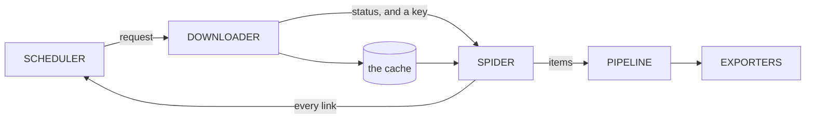

# scour

A focused web crawler that ranks links by how likely they are to hold what you
asked for.

An exhaustive crawler can use a queue: it is going everywhere anyway and only
the order changes. A focused crawler is choosing what *not* to fetch, and that
choice is the whole design. The parts are borrowed from Scrapy; what differs is
that they are services talking over NATS rather than objects calling each other,
and that a job brings its own engine with it.



Four stages and the exporters at the end. Only one arrow points backwards, and
it is the one that makes a focused crawl focused: every link a spider finds goes
back to the scheduler, which decides what comes out next.

## Start here

A job is one HCL document. It carries its own engine configuration, so a job
resubmitted next month does what it did today.

```console
$ scour init news > news.hcl
$ scour validate news.hcl
news.hcl: ok, 1 job(s): news

$ scour try news.hcl          # one page, cached, showing what each property found
$ scour run news.hcl          # the whole crawl, in this process, no server
$ scour train news.hcl        # read the cache, propose locators, write them back
```

`scour run` is not a demonstration mode. It is the same four stages the cluster
wires over the bus, wired directly instead, and a test holds one job to
producing the same records either way. A laptop is a complete deployment.

## The book

[**docs/**](docs/) is the design, in ten chapters. Every claim in them
is checked against the code by a test, so a chapter that drifts fails the build
rather than misleading somebody quietly.

| | |
| --- | --- |
| [One document, everything in it](docs/job/) | An HCL job carries its own engine |
| [Chains run both ways](docs/chains/) | Middleware wraps a stage, both directions |
| [Fetching, politely](docs/downloader/) | One request, inside what a site asked for |
| [The cache is the corpus](docs/cache/) | Bodies are kept because fetching is the expensive part |
| [What to fetch next](docs/frontier/) | The queue is the crawler |
| [Shapes, entities, measurements](docs/items/) | What is extracted, and what it refers to |
| [A graph, not a list](docs/pipeline/) | Steps run when what they require has run |
| [Local until it has to be shared](docs/cli/) | Twelve commands, and what each one needs |
| [Where everything lives](docs/storage/) | Eleven stores, each with one owner |

## Building it

```console
$ go build ./cmd/scour
$ go test ./...
```

Go 1.25 or newer, and no cgo: `CGO_ENABLED=0 go build ./...` is what the gate
runs. A single node needs nothing installed, because the broker is embedded and
the stores are SQLite files a crawl opens only if it asks for them.

## Where this is

All four stages are built and tested, and so is the bus between them. What is
not built is driving a crawl across the cluster, and applying a change to a job
that is already running; the last chapter lists the lot, and says which parts
are designed rather than written.

## Licence

GPL-3.0-or-later. See [LICENSE](LICENSE).
