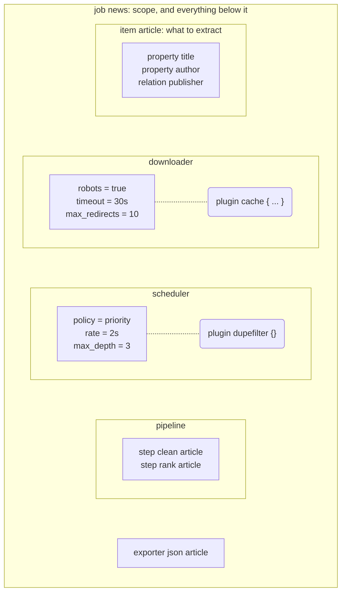

# One document, everything in it

*Chapter two of [the scour book](README.md).*

A job is an HCL document a client submits. It carries its own engine
configuration, so nothing is inherited from whichever server picks it up, and
a job resubmitted next month does what it did today.



<details>
<summary>What this diagram shows</summary>

A job block holding an item block, three stage blocks and an exporter. Inside a
stage block, attributes such as robots, timeout and rate are plain settings,
and a nested plugin block is a separate thing that was added to it.

</details>

*Every block is optional except the item blocks and the start URLs. The
division that matters is inside a stage: plain attributes, and nested plugin
blocks.*

## Attributes and plugins

**An attribute is behaviour the stage always has.** There is no meaningful
"off" for a request timeout, no meaningful position for it in an order, and
nowhere else it could have been written.

**A nested plugin is something you added.** It reorders, it turns off, and
somebody else can write it.

That division is what stops a setting drifting away from whatever enforces it.
A `max_body` kept in a different block would be a number the downloader might
or might not be reading, and the way you would find out is by downloading four
gigabytes.

It also removes the stage label from plugins. The block a plugin is written in
says which chain it joins, so the two cannot disagree. And the scheduler block
simply has no `external` attribute, which makes writing one a parse error with
a line and a column rather than a rule buried in a validator.

> **The rule that follows from it**
>
> Obligations are attributes, not plugins. A crawl with no cache is a valid
> crawl that costs you money; a crawl with no robots handling harms somebody
> else's server. A thing whose absence hurts a third party must not be opt-
> in through a mechanism that defaults to absent.

## What one looks like

```hcl
job "news" {
  domains  = ["example.com"]
  start    = ["https://example.com/topic"]

  item "article" {
    property "title" {
      type       = str
      required   = true
      transforms = [text, trim]
    }

    property "author" {
      type   = entity
      entity = "person"
    }
  }

  scheduler {
    policy      = "priority"
    rate        = "2s"
    concurrency = 2
    max_depth   = 3
  }

  downloader {
    robots        = true
    timeout       = "30s"
    max_redirects = 10

    plugin "cache" {
      backend    = "s3"
      bucket     = "pages"
      access_key = secret("acme-s3-key")
      secret_key = secret("acme-s3-secret")
    }
  }

  exporter "json" "article" {
    dir = "./out"
  }
}
```

Bare words like `str`, `entity` and `text` are a predeclared vocabulary rather
than strings, so a misspelling is a parse error pointing at the character
rather than a value that silently means nothing. Everything else is an
ordinary HCL string: `policy = "priority"` is a value the scheduler checks
against a list, not a word the parser knows.

## A plugin's configuration is nobody else's business

Everything inside a `plugin` block is left undecoded until the plugin is
built. The engine never learns what `bucket` means. That is what lets somebody
else write a plugin without changing anything here, and it is why a field the
plugin does not recognise comes back as an error with a line and a column
instead of being ignored.

It also makes secrets safe for free. `secret("acme-s3-key")` is an unevaluated
function call everywhere the job travels: the document submitted, the copy
stored, the diff shown when it is resubmitted, the output of `scour show`. It
becomes a credential exactly once, on the node building that plugin, and
nowhere it could be written down.

## Submitting the same name again

A job resubmitted under a name that is already running mutates it. What that
costs depends on what changed, and the document says in advance what it is
willing to pay:

| Change | Effect | Because |
| --- | --- | --- |
| A new start URL | Free | Adds work, invalidates none |
| A tighter budget | Free | Nothing already done becomes wrong |
| A narrowed scope | Costly | Queued URLs are now out of bounds |
| A changed item shape | Costly | Records were read under the old one |
| A moved cache | Costly | The corpus is somewhere else now |

A costly change is refused by default. A `mutation` block is how a job says
otherwise, and what to do with what the change invalidated: drop the out-of-
scope URLs or keep them, discard the stale records or re-extract them from
bodies already in the cache.

Every item shape carries a fingerprint that changes exactly when the shape
does, and every record says which fingerprint it was read under. Reordering
properties or renaming a job does not move it; adding an entity reference
does. That is what makes "which records are stale" a question with an answer
rather than a guess.

---

[Back: Four stages and a bus](README.md) · [Next: Chains run both ways](03-chains.md)
