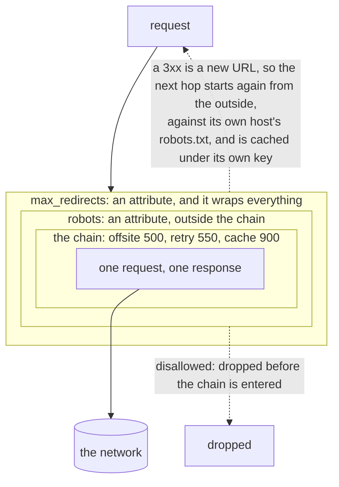

# Fetching, politely

*Chapter four of [the scour book](README.md).*

The downloader is a core that does one HTTP request and a chain around it.
What surrounds the chain is not configurable, because being wrong about it
harms somebody else.



<details>
<summary>What this diagram shows</summary>

A request passes through the redirect follower, then the robots check, then
the plugin chain, then the fetch. A disallowed URL is dropped at the robots
check before the chain is entered. A redirect sends the next hop back to the
outside, so it passes through the robots check for its own host.

</details>

*What wraps what. The chain is a job's business. The two things outside it
are not, and that is the whole reason they are drawn outside.*

## The core

One request, one response. The user agent, the timeout and the body limit live
here because none of them has a meaningful "off" and there is nowhere else
they could be written.

A body is refused on its declared length first, so a link to a video costs the
headers rather than the video. The read is bounded separately, because a
chunked response declares nothing and a server may simply lie. One byte over
the limit is read on purpose: without it, a body of exactly the limit and a
body of a gigabyte are the same read, and the only way to tell them apart is
to have read the gigabyte.

The timeout covers reading the body, not just the headers. A server that
answers instantly and then dribbles a body for an hour is the case a header-
only timeout does not catch.

**A status nobody wanted is still a response.** A 404 comes back with its
status and its body rather than as an error, because whether a 404 is a
failure is the spider's decision and `httperror` is where it is made. An error
from the downloader means the fetch did not happen at all: no connection, no
answer, a body over the limit, a context that ran out.

## robots.txt

It wraps the entire chain, so a refused URL is refused before the cache is
consulted and before a retry is scheduled. A job can turn it off, which is
legitimate against a site you own; it cannot quietly move it behind the cache,
which never is.

The file is fetched with the bare fetcher rather than through the chain.
Through the chain it would be checked against robots.txt, which is a loop, and
it would land in the page cache, where it would be served back long after the
site changed its mind. What a site permits has to be current. A success is
kept for the life of the job on this node; a failure is not kept at all, so a
network blip costs one request rather than a host.

| robots.txt answers | Which means |
| --- | --- |
| 2xx | The rules, as written |
| 4xx | A site with nothing to say. Most sites |
| 5xx | A site that could not tell us, which is not a site that said yes |
| nothing | The same |

RFC 9309 is implemented here rather than imported. Being wrong has a victim: a
parser that is subtly too permissive crawls what a site asked it not to, on
somebody else's machine, under our name, and nothing in our own output looks
wrong when it happens. That is a thing to read the specification for and hold
to a test suite.

The rule the whole file turns on is that the most specific match wins, by
pattern length, and an allow wins a tie. A site writes a broad disallow and
then allows the one directory it wants crawled:

```text
User-agent: *
Disallow: /
Allow: /public/
Disallow: /public/private/
```

> **A case worth knowing**
>
> Given `Disallow: *.gif$` and `Allow: /publications/`, a gif under
> `/publications/` is allowed: fourteen characters beat six. A site that
> meant otherwise has to say so with a longer pattern. This is the answer
> RFC 9309 requires, and it is not the one most people expect.

### The one thing in the file this stage cannot act on

`Crawl-delay` is read here and honoured somewhere else. Politeness is per host
and decided in the frontier, and these are two stages that may be on two
machines, so a number read here has to travel to be worth reading at all.

It rides back on the response, and over the bus in the fetch reply, as a delay
per host rather than one for the request: a redirect chain reads the robots.txt
of every host it passes through, and each of those sites asked for something.
The scheduler is the one place that knows which of them it has already recorded,
so that is where the list is deduplicated and handed to the frontier. What the
frontier then does with it is [the next chapter but one](06-frontier.md).

## Redirects

An HTTP client will follow redirects for you, and one it followed would be
invisible to everything above: the cache would hold the final body under the
original URL, and a redirect to another host would fetch that host's pages
without anyone reading its robots.txt. So the client is told to hand 3xx back,
and `max_redirects` decides what happens next.

Following wraps everything, robots included. Each hop re-enters the whole
downloader from the top: checked against its own host's rules, through every
middleware, cached under its own key. Setting `max_redirects = 0` follows none
and hands the 3xx back.

**Credentials do not follow a redirect off the host.** They were given to one
site, and this is exactly how they end up somewhere they were never meant to
go. On the same host they are kept, or a login would not survive the redirect
that every login ends with.

303, and 301 and 302 for anything that had a body, become GET, because that is
what every client does and therefore what every server expects. 307 and 308
exist because they do not.

A loop is not a drop. A site that redirects in a circle is broken, and
counting it as politeness would hide that, so it is an error naming the trail
it went round.

**A hop is checked against the job's scope before it is taken.** The scheduler
drops an out-of-scope URL before it is queued, and a redirect happens after
queueing, so the scheduler has already had its say and cannot have another.
Without a check here a job naming one exclusion followed a redirect straight
past it, which is worse than an ordinary scope leak: every other URL a crawl
considers went through the one place that decides, and this one did not. An
out-of-scope hop is a drop rather than a failure, because it is the ordinary
outcome for a URL outside the scope and not a sign anything went wrong.

> **What this will still become**
>
> A redirect that leaves the host is followed inline, which is right for the
> same-host case and is nearly all of them. Turning an off-host hop into a
> frontier request instead would give dedup and politeness a say in it as
> well. Scope already has one.

---

[Back: Chains run both ways](03-chains.md) · [Next: The cache is the corpus](05-cache.md)
