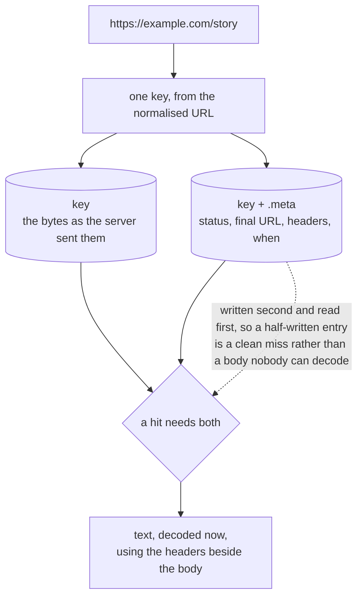

# The cache is the corpus

*Chapter five of [the scour book](README.md).*

Fetching is the expensive, rate-limited, impolite part of crawling.
Understanding a page is neither. Keeping the bodies is what lets extraction be
re-run, and re-run again after a change to how it works, without asking a site
for the same page twice.



<details>
<summary>What this diagram shows</summary>

A URL is hashed to a key. The key holds the body exactly as the server sent
it, and the same key with a dot-meta suffix holds the status, final URL,
headers and fetch time. Reading back requires both; decoding uses the headers
from the sidecar.

</details>

*One page, two keys. The body is kept exactly as it arrived; everything
needed to read it back correctly is kept beside it.*

## What is stored, and why in two keys

The cache itself is deliberately dumb: a key maps to bytes, and nothing else.
That is what lets the same interface be a directory on a laptop and a bucket
shared by a fleet, with the local filesystem, S3 and Google Cloud Storage
behind one contract that all three are held to by the same test suite.

Using two of those keys per page is the middleware's business and none of the
store's. The sidecar exists because a body on its own is not re-readable. A
page in windows-1251 that declared its encoding in the `Content-Type` header
and nowhere else decodes correctly on the way in and into mojibake on the way
back out.

This could have lived in the records database instead. It lives in the cache
because a corpus that cannot be read without a second database that happens to
still exist is not a corpus.

The body is written first. A hit needs both and reads the sidecar to decide,
so an interrupted write leaves an entry that is a clean miss, never a sidecar
promising a body that is not there.

## What the cache holds is what the server sent

Not decoded output. That is the more useful archive: detection improves, and
original bytes can be decoded again to get a better answer, while a corpus
decoded on the way in has its mistakes baked in until somebody re-crawls. It
is smaller, too, and faithful enough to revalidate.

The cost is that every read decodes. For a corpus re-analysed a few hundred
pages at a time that is nothing, and it buys the ability to be wrong about an
encoding and fix it later.

> **A decision that was reversed**
>
> Decoding was briefly a middleware, sitting at 600 so that what landed in
> the cache was already UTF-8. That was wrong twice over: it baked today's
> detection into the archive, and it only applied to bodies read through the
> downloader's chain, while the spider reads the cache directly by key and
> never passes through it. It is now a function both callers use, and the
> cache holds what arrived.

## A cache that fails does not fail the crawl

A read that errors is a miss. A write that errors is logged and dropped.
Losing a page that was successfully fetched because the disk that was only
ever an optimisation filled up is a bad trade, and the fetch has already been
paid for by then.

## What a job can say about it

| Setting | Default | What it decides |
| --- | --- | --- |
| `backend` | `local` | A directory, an S3 bucket or a GCS bucket |
| `bucket`, `prefix` | none | Where in it, so one bucket can hold several corpora |
| `ttl` | never | How old a hit may be. The difference between an archive and a monitor |
| `statuses` | `[200]` | What is worth keeping. A 404 says a URL is dead today, and caching it would keep saying so after the page came back |

```hcl
downloader {
  plugin "cache" {
    backend = "s3"
    bucket  = "pages"
    prefix  = "news/"
    ttl     = "24h"
  }
}
```

None of the credentials appear here. A cloud backend that needs one reaches
for `secret("name")`, which is resolved on the node building the plugin and
nowhere the job was written down.

---

[Back: Fetching, politely](04-downloader.md) · [Next: What to fetch next](06-frontier.md)
