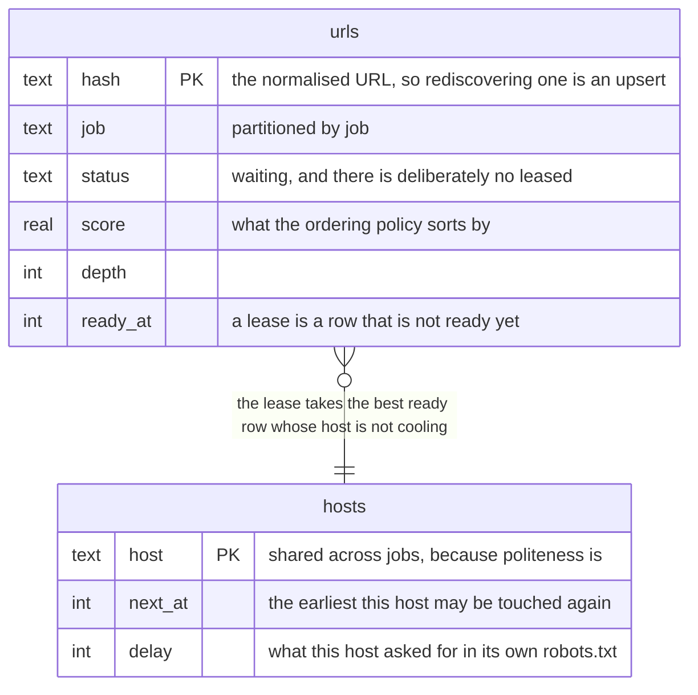

# What to fetch next

*Chapter six of [the scour book](README.md).*

An exhaustive crawler can use a queue: it is going everywhere anyway and only
the order changes. A focused crawler is choosing what not to fetch, and that
choice is the frontier.



<details>
<summary>What this diagram shows</summary>

Two tables. The urls table is per job and holds waiting URLs with a score, a
depth and the time each becomes ready again. The hosts table is shared across
jobs and holds, per host, the earliest time it may next be touched and the
delay it asked for. A lease joins them, taking the highest-scoring ready URL
whose host is not cooling.

</details>

*Two tables in one SQLite database. The urls table is partitioned by job; the
hosts table deliberately is not, because politeness cannot be.*

`next_at` and `delay` are kept apart rather than folded together because they
are different facts: the first is when this host may be touched again, the
second is how long it wants to be left alone every time. Folding them would
mean re-deriving the second from the first, which cannot be done once the first
has been overwritten.

## Why a database and not the bus

NATS carries everything else. It cannot carry this. JetStream is a work queue
and work queues are FIFO; a focused crawl is ranking, and the ranking changes
as the model learns. The one thing the frontier has to do is the one thing a
broker does not.

What it has to do at once: dedup by URL, hand out the highest-scoring entry
whose host is not cooling, lease it with a timeout, and survive a restart with
all of that intact.

```sql
BEGIN IMMEDIATE
SELECT 1 FROM hosts WHERE next_at <= ? LIMIT 1

SELECT u.hash, u.url, u.host, u.depth, u.score, u.parent, u.discovered, u.attempts,
       COALESCE(h.delay, 0)
  FROM urls u LEFT JOIN hosts h ON h.host = u.host
 WHERE u.job = ? AND u.status = 'waiting'
   AND u.ready_at <= ?
   AND (h.next_at IS NULL OR h.next_at <= ?)
 ORDER BY u.score DESC, u.discovered ASC, u.rowid ASC
 LIMIT 1
```

Hand-written SQL, no ORM. There are half a dozen queries and every one is
shaped by an index; an ORM would hide the thing most worth looking at.

The first query is a guard, and it is there for a reason worth reading the
performance section for: it asks whether any host is free at all, which is one
seek, and a lease that cannot possibly succeed says so without reading the
queue. It is sound because `hosts` holds a row for every host in the frontier,
which `Add` maintains and a migration backfilled. A free host does not mean a
leasable URL, so the guard only ever answers no early; the query below still
decides everything else.

Selecting and claiming have to be one act, or two schedulers that both chose
before either claimed would fetch the same page twice. SQLite has no `SELECT
... FOR UPDATE`; it rejects the syntax. What it has is `BEGIN IMMEDIATE`,
which takes the write lock when the transaction opens rather than when it
first writes. A port to Postgres adds `FOR UPDATE SKIP LOCKED` there, because
its readers are concurrent and the row has to be locked rather than the
database.

## The shape of the index is the whole performance story

There is no `leased` status. A leased row is a waiting row that is not ready
yet, and it says so with `ready_at`. The obvious schema, a second status,
makes the lease ask for one status *or* another, and an OR over the leading
column of an index is an index the query cannot use.

Each index is `(job, status)` equality and then the ordering columns, and
nothing else. Whether a row is ready and whether its host is cooling are
residuals, checked per row while SQLite walks the index in policy order and
stops at the first row that passes. Putting `ready_at` into the index ahead of
the ordering columns would turn the walk back into a sort.

| Lease | 1,000 URLs | 100,000 URLs |
| --- | --- | --- |
| Memory, the floor | 43 µs | 4.7 ms |
| SQLite, sorting | 965 µs | 47.9 ms |
| SQLite, walking an index | 357 µs | 369 µs |

Flat is the property that matters. A crawl leases once per page, so this query
is the ceiling on how fast anything can go, which is why the query plan is
asserted in a test rather than left to a benchmark somebody remembers to read.
`random` is exempt and always sorts: a shuffle of everything waiting is not
something an index can express.

**That table is measured with politeness off,** and this chapter used to stop
here. The benchmark's frontier has no rate, so no host ever cools, so the
residual never skips anything. Turn politeness on, which every real job does,
and the walk is what pays. There are two cases and they are different problems.

**Nothing is due.** A crawl of one site spends most of its life here: the host
is cooling, every waiting row is behind it, and finding that out by walking the
urls table means reading all of it, because SQLite cannot know a row fails the
check until it looks. That is 0.55 ms at a thousand URLs, 5.3 ms at ten
thousand and 69 ms at a hundred thousand, and it is not asked once: every worker
asks again on every idle tick for the length of the delay, holding the write
lock each time, which also blocks the `Add` that queues what the crawl is
finding. At a hundred thousand URLs a one-site crawl spent more than a core
proving it had nothing to do.

That is what the guard above fixes, by asking the right table. 17 µs at a
hundred thousand URLs, and flat. An index on `hosts (next_at)` makes it flat in
the number of hosts too: with 5,000 hosts all cooling it is 10 µs against 238 µs
without. Held by a test that asserts the cost as a ratio rather than the plan,
because the plan was already right when it was 69 ms.

**Something is due, but the best rows are cooling.** Not fixed, and it is worth
knowing about. Under `priority` the lease hands out the best-scoring row and
then cools that row's host, so the head of the index becomes a run of cooling
rows that grows by one host's worth per lease, and every later lease in the same
window walks it. Per-lease cost is linear in leases-per-politeness-window and
total work inside a window is quadratic: at 50,000 URLs over 5,000 hosts with a
30-second delay, 1.7 ms after 250 leases, 3.8 ms after 500, 8 ms after 1,000,
17 ms after 2,000, dropping back when the window turns over.

The fix is not an index. It is Heritrix's shape: one queue per host, a heap of
the ready ones and a delay queue of the snoozed, so a cooling host leaves the
candidate set instead of sitting at the head of it. That makes the host the unit
of scheduling rather than the URL, which is what politeness has been saying all
along.

## Politeness settles the layout

A rate limit is per host and shared between jobs. Two schedulers handing out
the same host cannot honour a crawl delay between them, so the frontier is
single-writer per host by construction, and SQLite is what a single writer
wants. When one process can no longer keep up, the answer is to shard by host,
which makes each shard single-writer again.

That is also why it is one database rather than one per job. Per-job files
would be tidier and would make dropping a job a delete, but host state cannot
be partitioned per job without two jobs on one site each getting their own
allowance, which is exactly what must not happen.

### What the site asked for has to get here

A site states its own `Crawl-delay` in robots.txt, which is read in the
downloader. Politeness is decided here. Those are two stages and they may be on
two machines, so without a way back the file was parsed, obeyed in every respect
but this one, and the number thrown away.

So the delay rides back on the response and over the bus in the fetch reply,
and `Pace` records it against the host and takes the hold it implies. A lease
then waits the longer of what the job configured and what the site asked for: a
crawl-delay belongs to the host and the rate belongs to the job, and honouring
only the second is how a `Crawl-delay` comes to be parsed and ignored.

Two things about `Pace` are easy to get wrong and are worth stating, because
both were.

**It adds the site's delay alone, never the longer of the two.** The job's rate
has already been applied by the lease that led here, measured from when that
lease was taken. Applying it again from now would measure it from after the
fetch, so every host that asked for nothing, which is nearly all of them, would
be left alone for a rate plus however long its page took to arrive. That is a
slower crawl for every ordinary site, bought by a feature about the unusual
ones. A delay shorter than the rate then falls out correctly rather than needing
a case: it pushes `next_at` to a moment already passed, and the hold the lease
took stands.

**`next_at` only ever moves forward.** A host cooling for longer than this delay
is a host somebody else is already being polite to, and the shorter of two
politeness rules is never the answer.

## Ordering is a plugin, at 500

The scheduler chains the same way the downloader does. A request passes
through on its way into the frontier and back out on its way to the
downloader, so low order is nearest the spider that discovered it and high
order is nearest the queue itself.

| Order | Name | What it does |
| --- | --- | --- |
| 100 | `dupefilter` | Decides what counts as already seen |
| 300 | `cron` | Defers a URL until it is due again |
| 450 | `topic` | Scores a URL against a topic, before the policy orders it |
| 500 | `priority` | Best first, by score. The default |
| 500 | `breadth` | Level by level, for an archival crawl |
| 500 | `depth` | Follows a spur down before returning |
| 500 | `random` | Samples without the sample being shaped by the scorer |

The four at 500 are alternatives, not a chain: a job picks one. They sit
against the queue because deciding what comes out next is the last thing that
happens on the way in and the first on the way out.

`dupefilter` at 100 is outermost because everything after it is work: a URL
already seen should be recognised before anything pays to think about it. What
it actually decides is what "the same URL" means, which is a question with no
right answer, only a right answer per site. Treating `?utm_source=x` as noise
is right nearly everywhere and wrong on a site that reads it; treating `/a/`
and `/a` as one page is right nearly everywhere and wrong on the servers that
do not. So a job that knows its site says so, and one that does not gets only
the transformations that cannot change what a server returns.

## Scope and budget are not plugins

`domains`, `included`, `excluded`, `max_depth` and `max_pages` are all
attributes, and an attribute's enforcement cannot be optional: a plugin that
could be turned off is a boundary that can be crossed by deleting a line. The
scheduler checks them itself, on the way into the frontier and outside the
chain, the same way robots.txt sits outside the downloader's.

**One rule, one implementation, and two stages that need it.** The scheduler
covers every URL a crawl decides to fetch, because deciding is what it is for.
It cannot cover a redirect: a hop is chosen by whoever controls a page the crawl
was already fetching, and it happens after queueing, so the scheduler has
already had its say and cannot have another. The downloader therefore checks the
target of a hop against the same scope before taking it. That check reads the
job's boundary from the one implementation rather than a second one of its own,
because two subtly different scope checks is a crawl that leaves the site
through whichever of them is looser.

The spider does not check and does not need to. Its output is links, which go to
the scheduler, which drops what is out of bounds before queueing.

`offsite` stays in the spider's and the downloader's tables, and there it
really is optional. Those two are catching work that did not come through this
scheduler, which on a single node is pure redundancy and across a cluster with
a spider somebody else wrote is not.

A job whose own boundary excludes every URL it starts from is refused outright
rather than crawled. Every start URL is dropped before it is queued, the
frontier is empty, and the run finishes in a millisecond and exits zero, which
is the worst shape a mistake can take: a success that did nothing.

## A frontier is changed in place, never rebuilt

It is the state a crawl resumes from, so there is no acceptable answer that
involves deleting it. `CREATE TABLE IF NOT EXISTS` does nothing to a table that
is already there, which means a column added later reaches new databases and no
existing one, so an older database is brought up to the current schema on open.

Adding a column can be asked for idempotently: the database is asked whether it
has one. Backfilling cannot, and the guard on the lease needs a backfill.
`hosts` has to hold a row for every host in the frontier, or a missing row reads
as a host that is not there rather than one that is free, which loses URLs
rather than slowing them down. Filling it is a scan of the urls table, and doing
that on every open to discover there was nothing to do is the cost a recorded
schema version exists to skip. Every step is still written to be safe if it runs
twice, because the version is the optimisation and not the guarantee.

> **Two implementations, one contract**
>
> An in-memory frontier exists as the reference implementation and the thing
> the contract suite was written against. Both run the same suite and the
> same benchmarks, which is what stops the contract from being a description
> of whichever store happened to be written first, and what made the
> comparison above possible at all.

---

[Back: The cache is the corpus](05-cache.md) · [Next: Shapes, entities, measurements](07-items.md)
