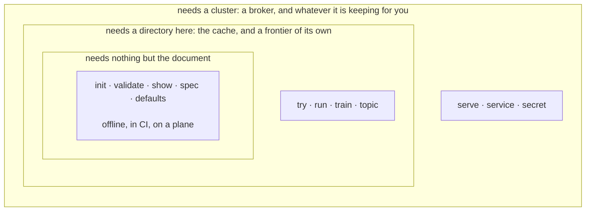

# Local until it has to be shared

*Chapter nine of [the scour book](index.md).*

A crawler is a thing you argue with before you run it. So the commands that
read a document need nothing running at all, and the line between those and
the rest is the first thing worth knowing about the command line.



<details>
<summary>What this diagram shows</summary>

Three nested rings of commands. The innermost holds init, validate, show, spec
and defaults, which need nothing but the document. Around it, try, run, train
and topic, which need a directory on this machine for the cache and the
frontier. Around those, serve, service and secret, which need a cluster. A
command in an outer ring needs everything in the rings inside it.

</details>

*What has to exist before a command can work. The innermost ring is the one
you are in while a job is still being written, which is most of the time.*

## The loop

Start from something that already validates, look at one page, then crawl a
few hundred and let induction propose the locators the guessing missed.

```console
$ scour init --list
basic      The plainest job that works. Start here
listing    A directory of entries: jobs, venues, courses
news       Articles: headline, byline, dates, body
product    A shop: name, price, availability, images

$ scour init news > news.hcl
$ scour validate news.hcl
news.hcl: ok, 1 job(s): news
```

**`try` is the one you will type most.** One page, fetched once and cached, so
the second run and the twentieth cost nothing and the site is asked once.
Against each property it prints the value and which of the four ways found it,
which is the only way to tell a locator that works from one that has never
been tested.

```console
$ scour try news.hcl
fetched https://example.com/  200  559 B  text/html  (125ms)

article
  title  "Example Domain"                    <h1>
  url    -                                   required, found nothing

1 of 2 properties found. 1 links.
```

The line with nothing on it is the interesting one, and it is why `try`
exists. Nothing is wrong with the document: the guess simply did not land on
this page, and the answer is an alias, a locator, or an example for training
to work from. What is listed is what was found plus the *required* properties
that were not, so an optional property that found nothing is absent from both
the output and the count, which is worth knowing before you read too much into
the ratio.

```console
$ scour run news.hcl
crawling news: 1 seeded, 1 queued
finished in 156ms
  fetched   1 (1 from the cache)
  dropped   0
  failed    0
  items     1
  exported  1
  wrote     json.article

$ scour train news.hcl
read 1 cached pages
  article.title                h1                           1/1 pages  "Example Domain"
nothing written. Pass --write to edit news.hcl
```

**The crawl reused what `try` had already fetched.** One page, asked for once,
whichever command wanted it. That is the cache doing the thing the whole
corpus argument is about, and it is why the loop above can be run twenty times
over a lunch break without leaning on anybody's server.

**Training proposes and does not commit.** It reads the cache and never the
network, so it is free and repeatable, and it prints what it would write until
`--write` says otherwise. What it does write is marked with a comment, and
only what is marked is ever overwritten: delete the comment and that locator
is yours for good. That one rule is what makes the loop converge instead of
going round.

> **Why the whole crawl runs here**
>
> `scour run` is not a demonstration mode. It is the same four stages the
> cluster wires over the bus, wired directly instead, and a test holds one
> job to producing the same records either way. A laptop is a complete
> deployment, which is what makes the loop above possible at all.

## What each one needs

| Command | What has to exist |
| --- | --- |
| `init`, `validate`, `show`, `spec`, `defaults` | The document, and nothing else |
| `try`, `train` | The cache on disk. Both read it and neither needs the network twice |
| `run` | A directory for the frontier and the cache |
| `topic` | A directory of trained topics, or a cluster to fetch one from |
| `serve` | Nothing, or `--join` to a cluster. With neither it starts a broker and prints the address to join |
| `service` | A directory per store, and a bus to answer on |
| `secret` | A cluster, and a sealing key that lives outside it |

`validate` is the exception that proves the rule. It parses, resolves and
checks, and it does not ask a server whether a plugin exists, which is what
makes it work in CI and is also why it cannot know about a plugin somebody
else's node has compiled in. That answer arrives when a chain is built, on the
machine that has the implementations.

## A setting belongs in the document, not in a flag

Every flag here is about *this invocation*: which job, which item, where the
cache is, whether to write. Nothing that decides what a crawl does is a flag,
and that is a rule rather than an accident.

A flag is typed once and gone. The next person runs the same command and gets
a different answer with nothing to show why, and the crawl that ran at three
in the morning cannot be reconstructed from anything. The document is the
whole of what a job does, so what a job does is written down, reviewed in a
diff, and the same next month.

```hcl
mutation {
  costly = "refuse"
}
```

**So there is no `--auto-approve`.** Whether a costly change may be applied is
the job's own statement, travelling with the job, so a machine submitting it
gets the same answer as a person. A flag that overrode it would make the
document advisory, and the first thing anybody would do is put the flag in a
script and forget it is there.

The same argument retires two flags that sound useful. **There is no
`--replace`** for training: what may be overwritten is decided by the marker
comment in the document, so a correction cannot be lost by forgetting a flag.
And **examples are a property's own field**, not something you teach at a
prompt, so they survive, they are reviewed like everything else, and re-
training is reproducible.

## Exit codes mean something

| Code | Meaning |
| --- | --- |
| 0 | It worked |
| 1 | The document was read and refused |
| 2 | The command line itself was wrong |
| 3 | scour could not do it, for a reason that is not the document's fault |

A wrong document and a broken tool are different things, and a script needs to
tell them apart: the first means fix your file, the second means the tool or
the machine needs looking at. Conflating them is how a broken build gets
retried forever.

```console
$ scour validate broken.hcl
scour: config: broken.hcl:4,27-31: Unknown variable; There is no variable
named "strr". Did you mean "str"?, and 1 other diagnostic(s)

$ scour validate nope.hcl
scour: open nope.hcl: no such file or directory
```

The first exits 1 and the second exits 3, and the difference is the whole
point: one of those files is wrong and the other was never read. Both report
every problem at once rather than the first, because a person fixing a
document one error per run gives up, and so does a build.

## Machine output on stdout, commentary on stderr

So `scour spec job.hcl > spec.hcl` writes a spec and not a spec with a
progress line in the middle of it. Anything with structure takes `--json`, and
human output is the default because the common case is a person. There is
never a third format for somebody to maintain.

> **Not built yet**
>
> `plan`, `apply`, `ls`, `status`, `logs`, `pause`, `resume`, `stop`, `rm`,
> `records` and `nodes`. Every one of them is a question about running
> state, which the command line deliberately does not hold, so each needs a
> server that does. `plan` is the one that earns the comparison with
> Terraform: the engine already computes a diff with an effect per change,
> so it can say that raising a page budget is free and that narrowing scope
> will drop 1,204 queued URLs, before anything happens. The diff is built
> and tested; nothing calls it yet.

---

[Back: A graph, not a list](pipeline.md) · [Next: Where everything lives](storage.md)
