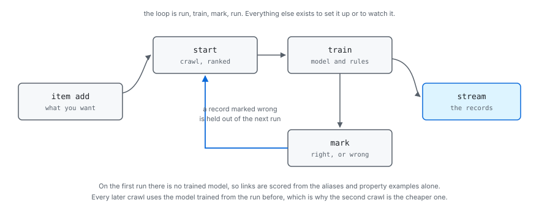

# Local until it has to be shared

*Chapter nine of [the scour book](../index.md).*

A crawler is a thing you argue with before you run it. So the commands that
read a document need nothing running at all, and the line between those and
the rest is the first thing worth knowing about the command line.

<figure>

<figcaption>What has to exist before a command can work. The innermost ring is the one you are in while a job is still being written, which is most of the time.</figcaption>
</figure>
## The loop

Start from something that already validates, look at one page, then crawl a
few hundred and let induction propose the locators the guessing missed.

```console
$ scour job init --list
basic      The plainest job that works. Start here
listing    A directory of entries: jobs, venues, courses
news       Articles: headline, byline, dates, body
product    A shop: name, price, availability, images

$ scour job init news > news.hcl
$ scour job valid news.hcl
news.hcl: ok, 1 job(s): news
```

**`scrape` is the one you will type most.** One page, fetched once and cached, so
the second run and the twentieth cost nothing and the site is asked once.
Against each property it prints the value and which of the four ways found it,
which is the only way to tell a locator that works from one that has never
been tested.

```console
$ scour scrape news.hcl
fetched https://example.com/  200  559 B  text/html  (125ms)

article
  title  "Example Domain"                    <h1>
  url    -                                   required, found nothing

1 of 2 properties found. 1 links.
```

The line with nothing on it is the interesting one, and it is why `scrape`
exists. Nothing is wrong with the document: the guess simply did not land on
this page, and the answer is an alias, a locator, or an example for training
to work from. What is listed is what was found plus the *required* properties
that were not, so an optional property that found nothing is absent from both
the output and the count, which is worth knowing before you read too much into
the ratio.

```console
$ scour crawl news.hcl
crawling news: 1 seeded, 1 queued
finished in 156ms
  fetched   1 (1 from the cache)
  dropped   0
  failed    0
  items     1
  exported  1
  wrote     json.article

$ scour job train --file news.hcl
read 1 cached pages
  article.title                h1                           1/1 pages  "Example Domain"
nothing written. Pass --write to edit news.hcl
```

**The crawl reused what `scrape` had already fetched.** One page, asked for once,
whichever command wanted it. That is the cache doing the thing the whole
corpus argument is about, and it is why the loop above can be run twenty times
over a lunch break without leaning on anybody's server.

**Training proposes and does not commit.** It reads the cache and never the
network, so it is free and repeatable, and it prints what it would write until
`--write` says otherwise. What it does write is marked with a comment, and
only what is marked is ever overwritten: delete the comment and that locator
is yours for good. That one rule is what makes the loop converge instead of
going round.

> **Why the whole crawl runs here**
>
> `scour crawl` is not a demonstration mode. It is the same four stages the
> cluster wires over the bus, wired directly instead, and a test holds one
> job to producing the same records either way. A laptop is a complete
> deployment, which is what makes the loop above possible at all.
## The surface

### Building a job

These need nothing running.

```
scour job init [name]        Print a starter job document
scour job valid <file>       Check it. Report every problem at once
scour scrape <file> [url]    One page, and what came out of it
scour crawl <file>           The whole crawl, here, without a server
scour defaults               Every default and its value
```

And these read a job, from a cluster or from a file with `--file`:

```
scour job show <job>         The resolved job: every default filled in
scour job spec <job>         What a spider is handed, as HCL
scour job train <job>        Read the cache, propose locators, write them back
```

#### `scour job`

Everything that happens to a job, under the noun it happens to. Seventeen
subcommands in three groups, which is why they are grouped: `scour job --help`
lists them under what somebody is doing rather than alphabetically.

| Flag | Effect |
| --- | --- |
| `--join <url>` | The cluster, as `nats://host:port`. Every cluster subcommand takes it |
| `--file <path>` | `show`, `spec` and `train` only: read a document instead of asking the cluster |
| `--list` | `init` only: list the templates and what they are for |
| `--force` | `init` only: overwrite the file if it is already there |
| `--fresh` | `start` and `run`: forget what a previous run queued |
| `--json` | `show` only: print as JSON |
| `--item <name>` | `train` only: only this shape |
| `--dir <path>` | Where the cache or the frontier is |
| `--pages <n>` | `train` only: how many cached pages to learn from |
| `--min <n>` | `train` only: ignore a locator matching fewer than this share of pages, as a percentage |
| `--write` | `train` only: write the locators back instead of printing what would change |
| `--job <name>` | `run` only: which job, if the document holds several |
| `--verbose`, `-v` | `run` only: log every page |

**Authoring a document**: `init`, `valid`, `train`, `run`. What somebody does
while a job is still being written, and all four take a file or a path.

**In the cluster**: `create`, `list`, `show`, `spec`, `update`, `delete`. A job
the cluster holds, by name.

**Running a crawl**: `start`, `stop`, `pause`, `resume`, `status`, `stats`,
`watch`. What the job service is doing with it.

The split is what each takes. A document command takes a path, because that is
what somebody editing a job has; a cluster command takes a name, because that is
a job's identity once submitted. A command accepting either would have to guess,
and would guess wrong the day somebody names a job after a file.

##### `scour job init [name]`

Prints a job that validates as it stands, so it can be run and then grown. To
stdout, so it composes.

##### `scour job valid <file>`

Parses and validates, reporting every problem at once rather than the first: a
person fixing a document one error per run gives up, and so does a build script.
It does not reach the network, so it works offline and in CI.

##### `scour job show <job>` and `scour job spec <job>`

`show` is the resolved job, every default filled in. `spec` is the narrower
thing: what a spider is handed and nothing else, as the HCL a person would have
written, which is what a spider in another language receives.

Both read the cluster's copy by default and a file with `--file`. The positional
argument names the job either way: in the cluster it is the job's identity, and
in a `--file` document holding several it says which. One argument, one meaning.

##### `scour job create <file>` and `scour job update <file>`

`create` submits a job the cluster does not have; a name already taken is
refused rather than replaced. `update` resubmits one it does. Creating a job
does not start it.

Both go through the job service, which is the only writer of the job store. That
is not ceremony: a submission has to be parsed, validated, and compared against
the revision already running, and every client doing that for itself is every
client doing it slightly differently.

**An update to a running job is reviewed first.** The job's own `mutation` block
says which changes may be applied to a crawl in progress, and the engine already
computes a diff with an effect per change: raising a page budget is free,
narrowing scope drops queued URLs, moving the cache orphans every body already
fetched. A change the policy refuses leaves the running revision alone and says
which change was refused. A running job keeps the revision it started with until
it is stopped and started again, and `scour job list` shows both when they
differ.

##### `scour job start <job>` and the rest of the lifecycle

```console
$ scour job start news
news is running
  since     2026-08-27T18:22:04Z
  revision  3
  driver    node-a
```

`start` seeds the frontier from the job's start URLs and drives the crawl.
`--fresh` forgets what a previous run queued; without it, starting a job that
was stopped carries on from where it was, because the frontier is on disk.

`stop` ends the loop and keeps the frontier. The pages already in flight are
finished rather than abandoned, so it takes as long as the last fetch, and the
command waits for that rather than returning while the exporters are still
flushing.

`pause` is `stop` with the intention recorded. The loop ends the same way and
the frontier is kept either way; what pause adds is that `resume` knows to carry
on rather than to seed again. There is no gate holding workers still inside the
crawl, because a frontier that survives a restart makes one unnecessary.

`status` is the phase. `stats` is how far the crawl has got, and a job that is
not running reports what is left in its frontier and nothing else: the counters
belong to a run, and the run is over.

`watch` follows the execution as it happens, and costs the crawl nothing because
the driver publishes and nobody subscribing slows it down:

```console
$ scour job watch news
news is running
  since     2026-08-27T18:22:04Z
  revision  3
  driver    node-a
18:22:06  running  fetched 12  items 9  exported 0  queued 47
18:22:08  running  fetched 31  items 24  exported 20  queued 61
18:22:34  done     finished
```

| Phase | Means |
| --- | --- |
| `stopped` | Submitted and not running. Also what a job that has never been started reports |
| `running` | Being driven right now |
| `paused` | The loop was stopped with the frontier kept, so `resume` carries on |
| `done` | The crawl ended on its own. `status` says whether the frontier ran dry or a budget was reached |
| `failed` | It stopped because something went wrong, and `status` says what |

#### `scour defaults`

Every default and its value, which is the answer to "what happens if I leave
this out" without reading the source.

| Flag | Effect |
| --- | --- |
| `--json` | Print as JSON |


The loop a person is actually in: change a selector, see what it pulls out, and
do it again. It has to be fast, which means it must not touch the network twice
for the same page.

#### `scour scrape <file> [url]`

Fetches one page, caches it, and runs it through extraction, printing what each
property found.

**The cache is used first, always.** A URL already in the cache is not fetched
again, so the second run and the two hundredth cost nothing and the site is
asked once. That is the whole reason this is usable as a development loop: the
edit-run cycle is against bytes on disk, not against somebody's server.

| Flag | Effect |
| --- | --- |
| `--job <name>` | Which job, if the document holds several |
| `--url <url>` | The page, if not given positionally. Defaults to the job's first start URL |
| `--refresh` | Fetch even if it is cached, and replace what is there |
| `--item <name>` | Only this shape |
| `--strict` | Exit non-zero if a required property found nothing |
| `--json` | Print as JSON |

```console
$ scour scrape news.hcl https://example.com/story/1
fetched  https://example.com/story/1  200  48.2 kB  text/html  (cached)

article
  url        https://example.com/story/1        <link rel=canonical>
  title      "Something happened yesterday"     <h1 class=headline>
  published  2026-08-04T09:15:00Z               <time datetime>
  body       4,812 characters                   <div class=article-body>

4 of 4 properties found.
```

Showing *where* each value came from is the point. A value on its own does not
tell you whether the locator will hold on the next page; the node it came from
does.

`--strict` is for CI: a job whose `required` properties stopped matching has
broken, and that should fail a build rather than quietly export nothing.

#### `scour crawl <file>`

Runs the whole engine in this process: scheduler, downloader, spider, pipeline
and exporters, wired to each other directly. No server, no cluster, no broker.

**It resumes.** The frontier is a file under `.scour` beside the document, so a
crawl that was stopped, or that hit its budget, continues where it left off.

| Flag | Effect |
| --- | --- |
| `--job <name>` | Which job, if the document holds several |
| `--dir <path>` | Where to keep the frontier and the cache |
| `--verbose`, `-v` | Log every page |
| `--fresh` | Forget what a previous run queued |

```console
$ scour crawl news.hcl
crawling news: 1 seeded, 1 queued
finished in 2.4s
  fetched   48 (12 from the cache)
  dropped   9
  failed    0
  items     41
  exported  41
  wrote     jsonlines.article
```

The summary says *why* it ended, because a crawl that finished a site and one
that ran out of budget look identical otherwise and mean opposite things.

The exporters are flushed and closed before that summary is printed, so what it
says was written has been. Reporting first and closing afterwards meant a write
that failed on the way out was invisible: the count was the number of records
handed over, not the number that landed, and a truncated export exited zero.

This is also the thing a cluster has to be equivalent to: the same job on
several nodes should produce the same records, and being able to run both is
what makes that checkable rather than merely claimed.

##### `scour job train <job>`

Reads the pages already in the cache, works out how to find each property, and
writes the locators back into the document.

**The locators go into the document, as text.** Not into a model file, not into
a database. The reason is that induction is a guess and a guess should be
readable: `css = [".article-body h1"]` is something a person can look at,
disagree with, correct, and commit. A binary model can only be trusted or
retrained. It also means the crawl has no runtime dependency on anything
training produced: the document is complete.

**It reads the cache and never the network,** so training is free, repeatable
and offline. The same corpus produces the same locators, which is what makes a
change to induction measurable rather than merely different.

```console
$ scour job train news.hcl
read 312 cached pages
  article.title                .headline                    308/312 pages  "Something happened yesterday"
  article.published_time       time[itemprop="datePublished"] 295/312 pages  "2026-08-04T09:15:00Z"
  article.body                 .article-body                311/312 pages  4812 characters
  article.author               kept, and never replaced
nothing written. Pass --write to edit news.hcl
```

| Flag | Effect |
| --- | --- |
| `--job <name>` | Which job, if the document holds several |
| `--item <name>` | Only this shape |
| `--dir <path>` | Where the cache is |
| `--pages <n>` | How many cached pages to learn from |
| `--min <n>` | Ignore a locator matching fewer than this share of pages, as a percentage |
| `--write` | Edit the document instead of printing what would change |

**Teaching by example goes in the document,** not on the command line. A
property's `examples` are values it is known to have taken, and given the answer
induction can look for the node that produces it and generalise across the
corpus. Written down, an example survives; typed into a shell, it is gone when
the terminal is. This is built: `train.Learn` looks for each example on the page
before it falls back to what extraction already finds.

There is no `--replace`. What may be overwritten is decided by the document
rather than by a flag, and the rule below is the whole of it.
##### Teaching it an answer

**Designed, not built.** The `examples` in the document are what training reads
today. What follows is the command-line shortcut for putting one there, and
nothing implements it yet: `scour job train` takes no `--url` and no `-i`.

Induction over a corpus can find what is *consistent*. It cannot know which
consistent thing you wanted, and on a page with three plausible headings it will
pick one and be confidently wrong. So you would hand it the answer.

The address is `<item>.<property>[.<part>]`, where the part says which bit of the
node to compare against:

| Part | Compares against |
| --- | --- |
| `text` | The node's text. The default, so it can be left out |
| `html` | The node's markup, for a property that keeps the formatting |
| `attr=<name>` | An attribute, for a URL in an `href` or a date in a `datetime` |

Given a value, training looks through the cached page for nodes that produce it,
generalises a locator across the rest of the corpus, and reports how far it got.
Three outcomes are worth naming because they are all useful:

- **One node produces it.** The locator is induced from there and checked
  against every other cached page.
- **Nothing produces it.** An error, and a good one: either the value is not on
  that page, or a transform is changing it before the comparison. Both are worth
  knowing before a crawl runs on the assumption.
- **Several nodes produce it.** The candidates are listed with their locators,
  and a more specific example is asked for. Guessing here is how a locator ends
  up pinned to the wrong one of two identical headings.

##### Where an example lives

In the document:

```hcl
property "title" {
  type     = str
  aliases  = ["headline"]
  examples = ["Hello World"]
}
```

**Examples belong in the job, not in a flag.** A flag teaches once and is gone,
so the next person to run `train` gets a different answer for no visible reason.
In the document they are evidence that travels with the shape, they are
reviewed in a diff like everything else, and re-running training is
reproducible.

They are evidence rather than configuration, which has one consequence worth
stating: **an example is not part of the spec's fingerprint.** Adding one does
not change what is being extracted, so it must not read as a schema change and
force a re-extraction of records that are still correct. An example that stops
matching is a signal that the site changed, not a setting that has gone stale.

Two rules about writing, and they are the ones worth arguing with:

**A locator a person wrote is never replaced.** Not by a flag: what training
wrote is marked, with `# induced by scour train; delete this comment to keep
your own`, and only what is marked is ever overwritten. Deleting the comment is
how a person says this one is theirs now, so the state lives in the document and
nowhere else. The alternative, a `--replace` somebody remembers to leave off,
loses a correction the first time they forget. The loop has to converge instead
of going in circles: correct it, retrain, lose the correction, correct it again.

**Comments and formatting survive.** The document is edited rather than
regenerated, so the notes somebody left themselves are still there afterwards.
That is why `internal/train/write.go` edits the lines a locator belongs on
rather than reprinting the file from its parse tree: a round trip through a
parser and a printer returns something equivalent and unrecognisable, and a diff
nobody can read is a diff nobody reviews. Reviewing what induction proposed is
the entire point, so the less clever approach is the right one.

The match count is written beside each locator as a comment, because a locator
that worked on 97 of 312 pages and one that worked on 311 deserve different
amounts of trust, and that number is invisible once the guess is in the file.

**Three hundred pages is enough.** Cost is linear in bytes at roughly half a
second a page, and 800 pages was not meaningfully better than 300. Crawl a few
hundred, train, and spend the time you saved looking at what it proposed.

**Train across several sites if the job crawls several sites.** A locator
induced from one site will be pinned to that site's markup, and the failure is
invisible until the second site quietly extracts nothing.
### Running a cluster

```
scour cluster join <url>       Remember a cluster, after checking it answers
scour cluster list             Who is in it now
scour server [service.hcl]     Run this machine's share of one
```

#### `scour cluster`

| Flag | Effect |
| --- | --- |
| `--join <url>` | `list` only: a cluster to ask, as `nats://host:port` |

`join` connects, lists who is there, and writes the address down. Every later
command uses it, so the address is typed once rather than on each command, which
is how people end up pointing half their commands at the wrong cluster.

It is remembered rather than configured. A file somebody edits would be a second
place for the address to be wrong, so this writes it and the commands read it.
The order is the flag, then `SCOUR_SERVER`, then whatever was last joined, then
the address a single node listens on: each is more deliberate than the next.

Nothing is written until the cluster has answered. Remembering an address that
does not work is worse than remembering none, because every later command fails
against it and nothing says where the address came from.

```console
$ scour cluster join nats://10.0.0.5:4222
NODE                     STAGES               BUS
node-a                   download,read        nats://10.0.0.5:4222
node-b                   download             nats://10.0.0.5:4222
joined nats://10.0.0.5:4222, remembered in ~/.config/scour/cluster
```

`join` joins nothing by itself: this is the client end. A machine offers work by
running `scour server --join <address>`.

#### `scour server [service.hcl]`

One machine's share of a cluster: the stages it offers, the job service that
submits and drives jobs, and the shared stores when a service document names
them.

| Flag | Effect |
| --- | --- |
| `--join <url>` | A server to join, as `nats://host:port` |
| `--name <name>` | What to call this node. Defaults to the hostname |
| `--dir <path>` | Where to keep the cache, the frontiers and the cluster's state |
| `--stages <list>` | Which stages to serve: `download`, `read`, or both |
| `--jobs` | Run the job service here. On by default |
| `--quiet` | Say nothing but failures |

This was two commands, `serve` and `service`, and the split was along the wrong
line: it divided what a process runs rather than what an operator decides.
Somebody bringing a cluster up had to start a node, start the stores, and then
discover that nothing at all submitted or drove a job. Three processes to answer
one question, and the third did not exist.

What it runs is decided by what it is given. Always a node and the job service,
because those are what a machine offering itself to a cluster is for. The shared
stores as well when a service document names them, because where the entity
graph lives is a decision somebody makes once and writes down.

With no `--join` it starts a broker in this process and prints the address the
next server should join, which is what makes a single machine need nothing
installed.

```console
$ scour server
node-a is serving, and is the broker listening on nats://127.0.0.1:41923
join it with: scour server --join nats://127.0.0.1:41923

$ scour server --join nats://127.0.0.1:41923 --name node-b
node-b joined nats://127.0.0.1:41923
```

A stage nothing serves is refused before the node announces itself, naming what
the stages are. A typo is the likeliest thing to be wrong with that flag, and
until it was checked at the door `--stages downlaod` connected, announced the
capacity into the registry, printed that it was serving, and then answered
nothing for the rest of its life while logging one warning per job.

**One driver per job, and it is the job service.** It owns the frontier and asks
the nodes to fetch and read, because the frontier cannot be shared: two
schedulers handing out the same host cannot honour a crawl delay between them.
That asymmetry is the politeness rule rather than a limitation to be lifted.

**The cache is shared between the node and the driver.** A body never crosses the
bus: the stage that fetched it writes it to the cache and only the key travels,
so the driver reads it back from there. On one machine `--dir` gives both the
same directory. A cluster across machines wants a cache every machine can see,
which is what the object-store backends are for, and `--jobs=false` keeps the
driver off a machine that is there only to fetch.

##### The service document

A service document is not a job document. A job says it wants entities; it does
not say where they live, and the difference matters more than it looks. The
entity graph is shared between jobs, which is the whole of its value: two jobs
crawling different sites should agree about who Acme is. A job document carries
everything one crawl needs so that a job resubmitted next month does what it did
today, so an address in it would mean whichever job was submitted last silently
decided where every other job's entities went, and a job moved between clusters
would carry the old cluster's address with it.

```hcl
entity {
  dir = "./graph"
}

event {
  dir = "./events"
}

topic {
  dir = "./topics"
}
```

| Field | Effect |
| --- | --- |
| `dir` | Where the store lives. Required: a store that vanishes on restart is one every writer believes it wrote to |
| `url` | The bus to answer on. Empty starts one in this process |
| `timeout` | How long one request may take. Default `30s` |

```console
$ scour server service.hcl
entities: serving ./graph on scour.entity.*
events: serving ./events on scour.event.*
topics: serving ./topics on scour.topic.*
jobs: serving on scour.jobs.*
node-a is serving, and is the broker listening on nats://127.0.0.1:41923
join it with: scour server --join nats://127.0.0.1:41923
```

**A node fetches topics from here.** A job's `topic` middleware takes a `url`
instead of a `dir`, and a node that has joined a cluster has no trained topics
on its disk:

```hcl
plugin "topic" {
  subject = "climate@7"
  url     = "nats://127.0.0.1:4222"
}
```

**A topic travels; a page does not.** A client fetches a trained topic once,
when the chain is built, and scores locally from then on. The scheduler scores
every URL it is offered and the spider every page it reads, so a request per
page would put the network in the hottest loop in the crawl, which is the same
reason a fetched body never crosses the bus and a cache key goes instead.

**The stores have one writer each**, because they are SQLite. That is why they
are behind a service rather than a file each node opens: a cluster where every
node opened the file would be one where the answer depended on which node you
asked, and where two nodes writing at once failed. Running a second server
against the same document joins the queue group as a standby that shares the
load, not as a second writer. The job service works the same way.

### Teaching it a subject

```
scour topic list                      What has been trained
scour topic propose <labels.hcl>    Label the cached corpus from seed terms
scour topic train <labels.hcl>      Learn from the labels, writing the next version
scour topic show <name@version>     What it learned
scour topic delete <name@version>
```

#### `scour topic`

A topic is a trained classifier a job refers to by name and version, as
`climate@7`. The scheduler scores every URL against it and puts the promising
ones at the front of the frontier; the spider scores every page and can drop the
ones that are not the subject. That is what makes a focused crawl focused.

| Flag | Effect |
| --- | --- |
| `--dir <path>` | Where the trained topics live. Default `.scour/topics` |
| `--corpus <path>` | Where the cached pages are. Default `.scour/cache` |
| `--pages <n>` | How many cached pages to look at |
| `--write` | `propose` only: edit the document instead of printing what would change |

**A topic is learned from a labels document**, which is a file you own:

```hcl
topic "climate" {
  terms = ["emissions", "decarbonisation", "carbon budget"]

  about = [
    "https://example.com/story/1",
  ]

  not = [
    "https://example.com/sport/2",
  ]
}
```

The loop is propose, correct, train:

```
$ scour topic propose labels.hcl --write
read 412 cached pages
  climate              38 proposed as the subject, 374 as not
wrote 412 proposals into labels.hcl. Correct them, then `scour topic train labels.hcl`

$ scour topic train labels.hcl
climate@1 trained on 412 examples
  strongest emissions, decarbonisation, climate, carbon, warming, targets, fuels, coal
  use it with: subject = "climate@1"
```

**The seed terms are a bootstrap, not the classifier.** A page holding enough of
them is proposed as an example, which is a worse classifier than the one being
trained and is meant to be: it is a first pass somebody corrects, and what they
correct is what wins. A model that only ever learned what it was already told
would have been a term list all along.

**The labels are a file for the same reason locators are.** A classifier trained
from state inside the tool says a page is about climate and there is nowhere to
go and look at why. `propose` never overwrites a decision somebody already made,
so a correction stays corrected across runs.

**Training writes the next version and never replaces one.** A job pins
`climate@7` precisely so that somebody else retraining cannot change what it
does, which is why the version is required in a job and why `rm` takes one
version rather than a subject.

A model is replaced by writing a new file beside the old one and renaming it
over the top, so a reader either gets the whole of one version or the whole of
the other. Writing in place truncated a file that `scour server` was serving
from, and a node asking for a model while somebody corrected it got half of one.
### Secrets

```
scour secret key            Print a new sealing key, once
scour secret set <name>     Store one, read from stdin
scour secret list             The names that have been set
scour secret delete <name>
```

#### `scour secret`

| Flag | Effect |
| --- | --- |
| `--join <url>` | The cluster, as `nats://host:port` |
| `--key-file <path>` | The sealing key, if it is not in `SCOUR_SECRET_KEY` |

On the subcommands rather than on `secret` itself, which takes none: every one
of them talks to the cluster, and `key` is the exception that needs neither.

A job holds a reference, never a value: `access_key = secret("acme-s3-key")`.
The document stays safe to commit, diff and paste into an issue, and the value
is resolved on the node that needs it, when it needs it.

**There is no `scour secret get`.** You can set one and rotate it, and if you
have lost it you rotate it. Read-back exists mostly to be misused: pasted into a
terminal, left in scrollback, attached to a ticket.

`set` reads from stdin rather than taking an argument, for the same reason. An
argument is in the shell history and in `ps` output the moment it runs.

```console
$ pbpaste | scour secret set acme-s3-key
stored acme-s3-key

$ scour secret list
acme-s3-key       set 2026-08-04
acme-s3-secret    set 2026-08-04
```
## A setting belongs in the document, not in a flag

Every flag here is about *this invocation*: which job, which item, where the
cache is, whether to write. Nothing that decides what a crawl does is a flag,
and that is a rule rather than an accident.

A flag is typed once and gone. The next person runs the same command and gets
a different answer with nothing to show why, and the crawl that ran at three
in the morning cannot be reconstructed from anything. The document is the
whole of what a job does, so what a job does is written down, reviewed in a
diff, and the same next month.

```hcl
mutation {
  costly = "refuse"
}
```

**So there is no `--auto-approve`.** Whether a costly change may be applied is
the job's own statement, travelling with the job, so a machine submitting it
gets the same answer as a person. A flag that overrode it would make the
document advisory, and the first thing anybody would do is put the flag in a
script and forget it is there.

The cost is real: changing a policy for one run means editing the document.
That is the intent, and it is the part most likely to be wrong.

The same argument retires two flags that sound useful. **There is no
`--replace`** for training: what may be overwritten is decided by the marker
comment in the document, so a correction cannot be lost by forgetting a flag.
And **examples are a property's own field**, not something you teach at a
prompt, so they survive, they are reviewed like everything else, and re-
training is reproducible.

## Rules

**Every problem at once, never the first.** A person fixing a document one
error per run gives up, and so does a build script.

**A file argument is positional.** `scour validate job.hcl`, not
`scour validate --file job.hcl`. It is the subject of the sentence.

**One document at a time.** A document can hold several jobs, and they are
accepted or refused together. Two documents at once would need rules about what
happens when the first is accepted and the second is not.

**A job is named when it is ambiguous, and not otherwise.** A document holding
one job needs no name on the command line. A document holding three and a
command given no name is refused rather than guessed at.

### Exit codes mean something

| Code | Meaning |
| --- | --- |
| 0 | It worked |
| 1 | The document was read and refused |
| 2 | The command line itself was wrong |
| 3 | scour could not do it, for a reason that is not the document's fault |

A wrong document and a broken tool are different things, and a script needs to
tell them apart: the first means fix your file, the second means the tool or
the machine needs looking at. Conflating them is how a broken build gets
retried forever.

```console
$ scour validate broken.hcl
scour: config: broken.hcl:4,27-31: Unknown variable; There is no variable
named "strr". Did you mean "str"?, and 1 other diagnostic(s)

$ scour validate nope.hcl
scour: open nope.hcl: no such file or directory
```

The first exits 1 and the second exits 3, and the difference is the whole
point: one of those files is wrong and the other was never read. A remote
command that cannot reach a server fails with 3 for the same reason: the
document was not refused, nothing looked at it.

### Machine output on stdout, commentary on stderr

So `scour job spec --file job.hcl > spec.hcl` writes a spec and not a spec with a
progress line in the middle of it. Anything with structure takes `--json`, and
human output is the default because the common case is a person. There is
never a third format for somebody to maintain.
## What exists today

Built and tested. This is the whole of what the binary has:

| Command | Needs |
| --- | --- |
| `scour job` | Nothing to write one; a cluster to submit or run one |
| `scour scrape` | The cache on disk |
| `scour crawl` | A directory for the frontier and the cache |
| `scour defaults` | Nothing |
| `scour cluster` | A cluster to ask |
| `scour server` | Nothing, or `--join` to a cluster |
| `scour topic` | A directory of trained topics, or a cluster |
| `scour secret` | A cluster, and a sealing key |

`job init`, `job valid`, `job show`, `job spec` and `defaults` need only the
engine package, which is why they work offline, in CI and on a plane. `crawl` is
the whole crawl in one process: the same four stages the cluster wires over the
bus, wired directly, and held to producing the same records either way.

> **What changed, and why the names moved**
>
> The tree was flat, back when a job was the only noun these commands acted on.
> It stopped being one: a cluster, its jobs, its topics and its secrets are four
> things somebody manages separately, and three of them had nowhere to live.
>
> `try` is `scrape`, `run` is `crawl`, and `serve` and `service` are one
> `server`. `init`, `valid`, `show`, `spec` and `train` moved under `job`, and
> `ls` and `rm` are `list` and `delete` wherever they appeared. The old names
> are gone rather than aliased: two names for one command is a tree somebody
> has to learn twice.
>
> The previous edition of this chapter listed `ls`, `status`, `pause`,
> `resume`, `stop`, `rm` and `nodes` as not built, each needing a server to
> hold running state. That server is `scour server`, and it holds it. What is
> still missing is `plan`: the engine computes the diff and `job update`
> applies its verdict, but nothing yet prints the diff before anything happens.

> **How this chapter is held to the binary**
>
> `cmd/scour/cli_doc_test.go` reads this file. It checks the table above
> against the commands the binary has, in both directions, and every flag
> against the command it is written under, also in both directions: a flag
> that exists and is undocumented fails, and so does a flag documented here
> that nothing takes. The second direction was added after this text spent a
> while promising `scour train --url`, `-i` and `--replace`, none of which
> were ever built, and after it said five commands were built when there were
> twelve. It is also what caught this chapter still describing `try`, `run`,
> `serve` and `service` after they had been renamed.

---

[Back: A graph, not a list](../pipeline/index.md) · [Next: Where everything lives](../storage/index.md)