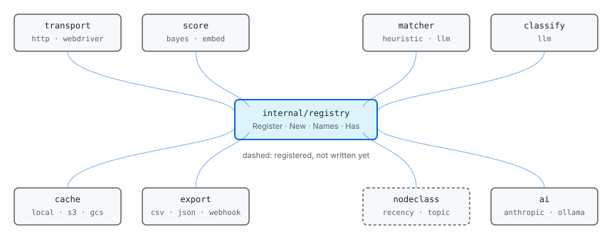

# The engine

scour is a generic crawler. The engine does not know what you are looking for,
and is not allowed to: what specializes it is trained, not compiled in. This
document is what the parts are, how they fit, and where to add your own.

The one rule that governs the rest: **if a behaviour cannot be expressed by
teaching, and it still changes the answer, it is in the wrong place.** Teaching
means the schema, the examples, the aliases, the value and name patterns, the
per-domain overrides, and the marks a person puts on records.

## The path a page takes


A crawl takes a URL from the frontier, fetches it through a transport, and
stores the body in the cache. Training reads the cache back, parses every body
into one graph, and induces the locators that find each property. Scoring
decides what the frontier hands out next, and is the only part of the loop that
learns from the last run.

## The parts

| Package | What it owns |
| --- | --- |
| `store` | Persistence. Owns the gorm models, the frontier, and every query. |
| `crawl` | Drives colly: the fetch loop, budgets, politeness, escalation. |
| `transport` | How a request reaches the network. |
| `cache` | Fetched page bodies, so a re-crawl and a retrain cost nothing twice. |
| `parse` | Turns cached pages into one wom graph. |
| `wom` | The Web Object Model: HTML, JSON, XML, PDF as one addressable graph, and induction over it. |
| `matcher` | How strongly one node satisfies one property. |
| `score` | How likely a URL is to lead to a match. |
| `nodeclass` | What a node of the crawl graph is: its role, its topic, its recency. |
| `classify` | What a fetched page is about, per page. |
| `train` | Induces an item's rules from its cached pages, and fits the chains. |
| `export` | Writes extracted records somewhere useful. |
| `bus` | How components talk when they are not in one process. |
| `service` | Runs those components, in any combination. |
| `server` | The HTTP API and MCP. |
| `cli` | The command line, grouped by what it does. |
| `registry` | The extension point the pluggable parts share. |
| `ai` | Access to language models, for the parts that consult one. |
| `config` | config.toml, environment, flag precedence. |
| `content` | Which content types a crawl may traverse. |
| `defaults` | The schemas scour ships with. |
| `tui` | What the live view shows, apart from how it is drawn. |

## Extension points

Every pluggable part is a registry. They differ in what they produce and in what
they are built from, and in nothing else, so they share one implementation in
`internal/registry`.



| Kind | Interface | Ships with | Selected by |
| --- | --- | --- | --- |
| transport | `http.RoundTripper` | `http`, `webdriver` | `[[host]] transport` |
| score | `Scorer` | `bayes`, `embed` | `[model] scorer` |
| matcher | `wom.Matcher` | `heuristic`, `llm` | `[model] matcher` |

| classify | `Classifier` | `llm` | `[model] classifier` |
| nodeclass | `Classifier` | `recency`*, `topic`* | not yet wired |
| cache | `Store` | `local`, `s3`†, `gcs`† | `[cache] driver` |
| export | `Exporter` | `csv`, `json`, `webhook` | `scour stream --write` |
| schedule | `Policy` | `best`, `breadth`, `depth`, `random`, `warmup` | `[crawl] scheduler` |
| refresh | `Refresh` | `cron`* | `[crawl] refresh` |
| ai | provider | `anthropic`, `ollama` | `[[ai]] provider` |

\* registered, not written yet: they answer `ErrNotImplemented` so a name in a
config file resolves to "this is planned" rather than to "unknown", which reads
as a typo.
† compiled in only with `-tags cloud`, which costs 41MB of SDK.

### Adding an implementation

Register it from `init` in its own package, and have whatever selects it import
that package for its side effects:

```go
func init() {
    transport.Register("myproxy", func(cfg transport.Config) (http.RoundTripper, error) {
        return &myProxy{timeout: cfg.Timeout}, nil
    })
}
```

Registration is not import-order sensitive: nothing reads a registry until a
name is looked up.

### Adding a kind of extension

Declare the interface and the config it is built from, make a registry for the
pair, and export four wrappers:

```go
var reg = registry.New[Config, Thinger]("thinger").Default("simple")

func Register(name string, f registry.Factory[Config, Thinger]) { reg.Register(name, f) }
func New(name string, cfg Config) (Thinger, error)              { return reg.New(name, cfg) }
func Names() []string                                           { return reg.Names() }
func Has(name string) bool                                      { return reg.Has(name) }
```

The wrappers are kept rather than exposing the registry value, because they are
what callers import: scour's own packages say `score.New`, and an implementation
registers itself without knowing `registry` exists.

## Classifying the crawl graph

`nodeclass` is the newest point and the one with the most room, so it is worth
saying what it is for.

A node is a URL, and the graph is how the crawl reached it. Whether a page holds
records is a fact about the URL and its place in the site, not about any element
on it: answering it from the markup means asking the same question of every node
in a document instead of once per page, and "this page links to records but
holds none" cannot be seen from the markup at all.

A node carries more than one answer. What role it plays, what it is about, how
fresh it is: different questions, different vocabularies, different evidence. So
a classifier declares its `Kind`, and verdicts are held per kind. Two
classifiers of one kind are alternatives; two of different kinds both run.

The role question has an answer that nothing reads, and reading it would not
help. `internal/score/hmm` decodes six roles over the parent path of every URL,
stores them, and `scour item ls` prints them. Outside that package `hmm.Detail`
has no callers, so extraction runs over every fetched page whatever the crawl
graph concluded.

Gating extraction on that role was the obvious fix and it is the wrong one,
because the role is derived from extraction. Within one training run,
`Trainer.extract` writes a match count per URL and `Trainer.trainChain` then
fits the chain from those counts; `observationsOf` tests `Matches > 0` before
`Links > 0`, so any page a record came out of is observed as `Records` and
decoded as `Detail`. Gating extraction on the role would gate it on its own
output.

The corpus says so plainly: 866 of news2's 867 records come from pages already
labelled `detail`, and every one of the 118 short titles is among them. The gate
would drop one record and fix nothing. That figure is not the classifier
agreeing with extraction, it is the classifier restating it.

What the fault actually is, in two parts. Section index URLs like
`/news/community/` are decoded `detail` when they are hubs, which is the
circularity above. And `/eedition/special_section/page_...`, `/ads/sale/...` and
`/helpcenter/article_...` really are detail pages, just not articles: a
different subject, which is a topic question and not a role one.

So the chain needs evidence that does not come from extraction. Outlink count,
URL shape, whether a page's children were themselves worth fetching: all are
known before anything is extracted, and none is in the four observations it
reads today. That is the work, and it is larger than reading a stored answer.

## Scoring, which is per graph

scour has more than one graph, and both get ranked.

| Node | Question | Interface | Registry |
| --- | --- | --- | --- |
| a URL in the crawl graph | how likely is this to lead to a match? | `Score(Features) float64` | `internal/score` |
| a node of a parsed page | how strongly is this that field? | `Score(ctx, Prop, *Node) float64` | `internal/matcher` |

They are the same kind of extension over different graphs, and they looked
unrelated only because one of them was called a matcher. Each registry now
declares what it ranks, as `score.Ranks` and `matcher.Ranks`, and `score.Kinds`
is the one place that says what can be scored and where the registry for it
lives.

They stay two registries rather than one. A scorer of one kind takes an input
the other cannot produce, so folding them together would mean a cast at every
call, and a feed's items or a PDF's regions would want a third input again. The
kind is what makes room for that without pretending the inputs are the same.

The URL scorer has a second layer worth knowing about. `internal/score/hmm`
wraps a base scorer with the crawl chain: the base answers "does this URL look
like a record page", which is the wrong question for a hub, and the chain
answers "does this URL lead to one", which is the right one. Neither is
sufficient alone, so the two are combined as independent evidence in odds form.

## Scheduling, which is two questions

A crawl has more URLs waiting than it will ever fetch, so the order they come
out in is most of what a crawl is. That is one question. The other is when a URL
goes back in: a front page carries something different every hour, an archived
article never changes again, and crawling them at one rate is either wasteful at
one end or stale at the other.

They are separate registries because they are separate decisions. `Policy`
orders what is already waiting; `Refresh` decides what is due. Splitting them is
what lets a site be crawled once and then kept current cheaply, which is a
different job from crawling it the first time.

A `Policy` returns an order from a closed set rather than a SQL fragment. The
frontier is a table with a hundred thousand rows in it, so the choice has to be
made by the database, and taking SQL from a policy would be taking an injection
point and a dependency on the schema at once. It is asked once per lease rather
than once per crawl, so `warmup` can crawl broadly until a model exists and
best first after that: before there is a model every score is equal, and
ordering by score is ordering by noise.

Neither decides politeness. Which hosts are cooling is worked out from when each
was last fetched, and a policy that could override that could hammer a server by
choosing badly.

## What is not extensible, and why

The six roles, the inference constants, and the tuned thresholds in `wom` are
the engine's own. They are not configuration, because a knob is a way of asking
someone to tune what should have been measured. They are changed by measuring
against the corpora and re-measuring, which is what `README.md` records.

Entries like `semanticTags` are allowed to name HTML elements because their
meaning comes from the specification rather than from a corpus: `<time>` is a
date on a Greek page as much as an English one. A table of words that only
holds for news would not be allowed there, and belongs in a shipped schema
under `defaults`, where it is a starting point somebody can replace.
