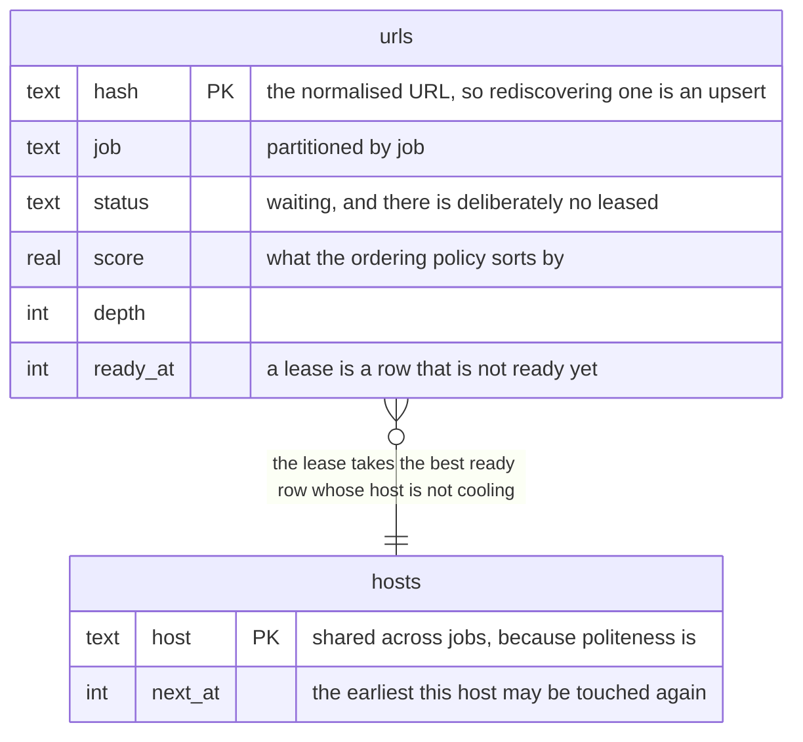

# What to fetch next

*Chapter six of [the scour book](index.md).*

An exhaustive crawler can use a queue: it is going everywhere anyway and only
the order changes. A focused crawler is choosing what not to fetch, and that
choice is the frontier.



<details>
<summary>What this diagram shows</summary>

Two tables. The urls table is per job and holds waiting URLs with a score, a
depth and the time each becomes ready again. The hosts table is shared across
jobs and holds the earliest time each host may next be touched. A lease joins
them, taking the highest-scoring ready URL whose host is not cooling.

</details>

*Two tables in one SQLite database. The urls table is partitioned by job; the
hosts table deliberately is not, because politeness cannot be.*

## Why a database and not the bus

NATS carries everything else. It cannot carry this. JetStream is a work queue
and work queues are FIFO; a focused crawl is ranking, and the ranking changes
as the model learns. The one thing the frontier has to do is the one thing a
broker does not.

What it has to do at once: dedup by URL, hand out the highest-scoring entry
whose host is not cooling, lease it with a timeout, and survive a restart with
all of that intact.

```sql
BEGIN IMMEDIATE
SELECT u.hash, u.url, u.host, u.depth, u.score, u.parent, u.discovered, u.attempts
  FROM urls u LEFT JOIN hosts h ON h.host = u.host
 WHERE u.job = ? AND u.status = 'waiting'
   AND u.ready_at <= ?
   AND (h.next_at IS NULL OR h.next_at <= ?)
 ORDER BY u.score DESC, u.discovered ASC, u.rowid ASC
 LIMIT 1
```

Hand-written SQL, no ORM. There are half a dozen queries and every one is
shaped by an index; an ORM would hide the thing most worth looking at.

Selecting and claiming have to be one act, or two schedulers that both chose
before either claimed would fetch the same page twice. SQLite has no `SELECT
... FOR UPDATE`; it rejects the syntax. What it has is `BEGIN IMMEDIATE`,
which takes the write lock when the transaction opens rather than when it
first writes. A port to Postgres adds `FOR UPDATE SKIP LOCKED` there, because
its readers are concurrent and the row has to be locked rather than the
database.

## The shape of the index is the whole performance story

There is no `leased` status. A leased row is a waiting row that is not ready
yet, and it says so with `ready_at`. The obvious schema, a second status,
makes the lease ask for one status *or* another, and an OR over the leading
column of an index is an index the query cannot use.

Each index is `(job, status)` equality and then the ordering columns, and
nothing else. Whether a row is ready and whether its host is cooling are
residuals, checked per row while SQLite walks the index in policy order and
stops at the first row that passes, which is nearly always the first row it
looks at. Putting `ready_at` into the index ahead of the ordering columns
would turn the walk back into a sort.

| Lease | 1,000 URLs | 100,000 URLs |
| --- | --- | --- |
| Memory, the floor | 43 µs | 4.7 ms |
| SQLite, sorting | 965 µs | 47.9 ms |
| SQLite, walking an index | 357 µs | 369 µs |

Flat is the property that matters. A crawl leases once per page, so this query
is the ceiling on how fast anything can go, which is why the query plan is
asserted in a test rather than left to a benchmark somebody remembers to read.
`random` is exempt and always sorts: a shuffle of everything waiting is not
something an index can express.

## Politeness settles the layout

A rate limit is per host and shared between jobs. Two schedulers handing out
the same host cannot honour a crawl delay between them, so the frontier is
single-writer per host by construction, and SQLite is what a single writer
wants. When one process can no longer keep up, the answer is to shard by host,
which makes each shard single-writer again.

That is also why it is one database rather than one per job. Per-job files
would be tidier and would make dropping a job a delete, but host state cannot
be partitioned per job without two jobs on one site each getting their own
allowance, which is exactly what must not happen.

## Ordering is a plugin, at 500

The scheduler chains the same way the downloader does. A request passes
through on its way into the frontier and back out on its way to the
downloader, so low order is nearest the spider that discovered it and high
order is nearest the queue itself.

| Order | Name | What it does |
| --- | --- | --- |
| 100 | `dupefilter` | Decides what counts as already seen |
| 300 | `cron` | Defers a URL until it is due again |
| 450 | `topic` | Scores a URL against a topic, before the policy orders it |
| 500 | `priority` | Best first, by score. The default |
| 500 | `breadth` | Level by level, for an archival crawl |
| 500 | `depth` | Follows a spur down before returning |
| 500 | `random` | Samples without the sample being shaped by the scorer |

The four at 500 are alternatives, not a chain: a job picks one. They sit
against the queue because deciding what comes out next is the last thing that
happens on the way in and the first on the way out.

`dupefilter` at 100 is outermost because everything after it is work: a URL
already seen should be recognised before anything pays to think about it. What
it actually decides is what "the same URL" means, which is a question with no
right answer, only a right answer per site. Treating `?utm_source=x` as noise
is right nearly everywhere and wrong on a site that reads it; treating `/a/`
and `/a` as one page is right nearly everywhere and wrong on the servers that
do not. So a job that knows its site says so, and one that does not gets only
the transformations that cannot change what a server returns.

## Scope and budget are not plugins

`domains`, `included`, `excluded`, `max_depth` and `max_pages` are all
attributes, and an attribute's enforcement cannot be optional: a plugin that
could be turned off is a boundary that can be crossed by deleting a line. The
scheduler checks them itself, on the way into the frontier and outside the
chain, the same way robots.txt sits outside the downloader's.

`offsite` stays in the spider's and the downloader's tables, and there it
really is optional. Those two are catching work that did not come through this
scheduler, which on a single node is pure redundancy and across a cluster with
a spider somebody else wrote is not.

> **Two implementations, one contract**
>
> An in-memory frontier exists as the reference implementation and the thing
> the contract suite was written against. Both run the same suite and the
> same benchmarks, which is what stops the contract from being a description
> of whichever store happened to be written first, and what made the
> comparison above possible at all.

---

[Back: The cache is the corpus](cache.md) · [Next: Shapes, entities, measurements](items.md)
