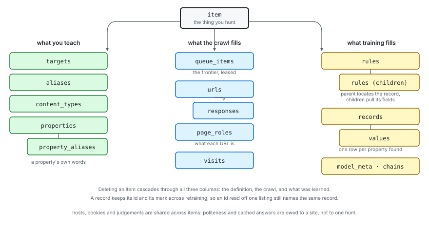
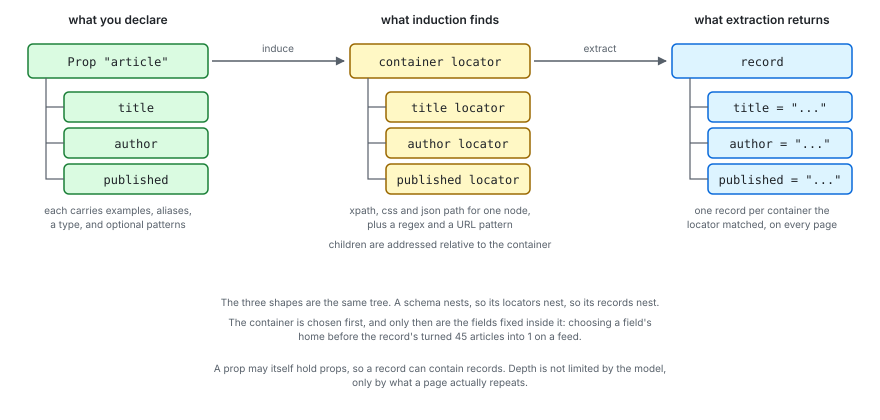

# The hierarchies

Three trees run through scour, and they are not the same tree. One is what you
teach and what gets stored. One is what a schema declares and what comes back.
One is the crawl graph, which is the only one whose shape scour discovers rather
than being told.

## What an item owns



An item is the thing you are hunting for, and everything hangs off it in three
columns: what you teach, what the crawl fills in, and what training produces.
Deleting an item cascades through all three.

Two tables sit outside that. `hosts` and `cookies` are keyed by site rather than
by item, because politeness and session state are owed to a server and not to
one hunt: two items crawling the same site should share the rate limit and not
the queue. `judgements` is a cache of what a model was asked, keyed by the
question, so the same question asked across pages, items and retrains is paid
for once.

## What a schema becomes



The three shapes are one tree. A schema nests, so its locators nest, so its
records nest. The outer prop names the record and its children are the fields,
and a prop may itself hold props, so a record can contain records. Depth is not
limited by the model, only by what a page actually repeats.

The order matters and was got wrong once. The container is chosen first, and
only then are the fields fixed inside it. Choosing where a field lives before
knowing where the record lives let a feed's logo beat the article, and forty
five articles became one.

## What the crawl discovers

The crawl graph is nodes and the paths taken to reach them. Every URL has a
parent, back to a seed, and that path is what a sequence model reads to decide
what each page is: a seed, a hub that lists records, another page of the same
listing, a detail page that holds them, boilerplate, or a dead end.

That is the one hierarchy scour is not told. It comes out of crawling, which is
why `scour item ls` reports it as something learned:

```
roles       detail 793, dead 41, seed 17
```

Six roles over the parent path of every URL, stored per node. See
[the engine](engine.html) for what reads them, and what does not yet.
