# scour

A focused web crawler that ranks links by how likely they are to hold what you
want.

You tell scour what you care about: an item, the other words a page might use
for it, and the properties it should have. scour crawls outward from your seed
targets, giving every discovered URL a probability that it holds a match.
Instead of scraping whole sites and filtering afterwards, you get a ranked
frontier and spend your crawl budget on the pages most likely to pay off.

- **[The engine](engine.html)**: what the parts are, and how to extend them.
- **[Measured results](results.html)**: what it extracts, on live corpora.

## The loop



A crawl takes a URL from the frontier, fetches it through a transport, and
stores the body in the cache. Training reads the cache back, parses every body
into one graph, and induces the locators that find each property. Scoring
decides what the frontier hands out next, and is the only part of the loop that
learns from the last run.

## Getting started

```
scour item add vehicle --alias car -d example.com
scour item add vehicle -p make -e Ford -p model -e 'F-Series'
scour start vehicle --depth 3
scour train vehicle
scour stream vehicle
```

`scour item templates` lists the schemas that ship with it, so a common shape
does not have to be typed out.

## What it is not

scour is generic. The engine does not know what you are looking for and is not
allowed to: what specializes it is trained, not compiled in. If a behaviour
cannot be expressed by teaching, and it still changes the answer, it is in the
wrong place. That rule is what the [engine documentation](engine.html) is
mostly about.
