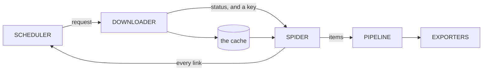

# Four stages and a bus

*A book about the engine, in nine chapters. Every claim in them is checked
against the code by a test, so a chapter that drifts fails the build.*

A crawler that ranks links by how likely they are to hold what you asked for.
The parts are borrowed from Scrapy; what differs is that they are services
talking over NATS rather than objects calling each other, and that a job
brings its own engine with it.

What this diagram shows

Requests flow from the scheduler to the downloader to the spider to the
pipeline and out to exporters, with new requests looping from the spider back
to the scheduler. Between the downloader and the spider only a cache key
crosses; the body itself goes down into the shared cache and back up.

*The whole engine. What travels between the downloader and the spider is a
status and a cache key, never a body: the body goes down into the shared cache
and back up, which is why two things read one, and why decoding is a function
both call rather than a link in either chain. Only one arrow points backwards,
and it is the one that makes a focused crawl focused.*

Read it left to right and the shape is ordinary: something decides what to
fetch, something fetches it, something reads what came back, something does
the work on what was read. Four stages, and the exporters at the end.

Three things about the picture are worth more than the boxes.

### Only one arrow points backwards

Every link a spider finds goes back to the scheduler, and the scheduler
decides what comes out next. That loop is where a focused crawl differs from
an exhaustive one: an exhaustive crawler can use a queue, because it is going
everywhere anyway and only the order changes. A focused crawler is choosing
what *not* to fetch, and that choice happens in the one place every discovered
URL passes through.

### A body never crosses the bus

The message from the downloader to the spider carries a status and a cache
key. The body itself went down into the cache, and the spider reads it back
out by that key.

That keeps a megabyte of HTML off the message bus, which matters at any real
rate. It also means two different things read a body, which is why turning
bytes into text is a function both of them call rather than a link in either
chain: a decode that lived in the downloader's middleware would apply to the
downloader and not to the spider, and the corpus would be UTF-8 only when it
happened to be read the long way round.

### The scheduler is the one stage a job may not replace

Any other stage can be handed to somebody else: a spider written in Python
that subscribes to the bus is a first-class spider. The scheduler cannot be,
because politeness is per host and shared. Two schedulers handing out the same
host cannot honour a crawl delay between them, so there is one decision point
per host and that settles it.

> **Where this is**
>
> All four stages are built and tested, and so is the bus between them:
> `scour run` crawls a job in one process and the same job produces the same
> records wired either way. What is not built is driving a crawl across the
> cluster, and applying a change to a job that is already running. The last
> chapter lists the lot.

## Contents

- [One document, everything in it](job.md)  
  An HCL job carries its own engine, so nothing is inherited from whichever server picks it up.
- [Chains run both ways](chains.md)  
  Middleware wraps a stage, so every link sees the request going out and the response coming back.
- [Fetching, politely](downloader.md)  
  One request, wrapped in what a job asked for, inside what a site asked for.
- [The cache is the corpus](cache.md)  
  Bodies are kept because understanding a page is cheap and fetching it is not.
- [What to fetch next](frontier.md)  
  The queue is the crawler. Ordering it is most of what focused means.
- [Shapes, entities, measurements](items.md)  
  What is extracted, what it refers to, and what it becomes when it flows.
- [A graph, not a list](pipeline.md)  
  Steps run when what they require has run, and exporters each write one item.
- [Local until it has to be shared](cli.md)  
  Twelve commands, the loop they make, and the line between what runs here and what needs a cluster.
- [Where everything lives](storage.md)  
  Eleven stores, each with one owner and one reason to exist.

---

[Next: One document, everything in it](job.md)
