# Shapes, entities, measurements

*Chapter seven of [the scour book](../index.md).*

A job declares what it is looking for. One declaration has three lives: a
shape a spider extracts against, a set of assertions about things in the
world, and a measurement when it flows.

<figure>

<figcaption>One model, three renderings. Nothing in a document says "this is an event"; what makes it one is that the properties split cleanly into things you group by and things you measure.</figcaption>
</figure>

## Properties, and what a type buys

A property says what to look for, what shape the answer has, and how to clean
it up. Aliases, regexes, XPath and CSS are all evidence about where a value
lives; transforms are what to do with it once found.

```hcl
property "title" {
  type       = str
  required   = true
  aliases    = ["headline", "og:title"]
  transforms = [text, trim]
  examples   = ["Hello World"]
}
```

`examples` are evidence about how to find a value, not about what is being
extracted, so adding one does not change the item's fingerprint and does not
force a re-extraction of records that are still correct. Changing `type` does.

## An entity is a thing, not a string

A byline is text. The author is a person, and the same person appears in a
thousand articles under four spellings. Declaring `type = entity` says the
extracted text refers to something that exists independently of this page:

```hcl
property "author" {
  type   = entity
  entity = "person"
}

relation "publisher" {
  entity   = "company"
  property = self.domain
  topic    = ["climate@7"]
}
```

A property is extracted from the page. A relation is not: the publisher is the
site, so `self.domain` says where the value comes from instead. `self.` is a
predeclared vocabulary, so a misspelling is a parse error rather than an empty
value.

Everything the store keeps is an assertion with provenance: who said it, from
which page, under which item fingerprint, when. That is what makes a wrong
entity correctable rather than a fact that has quietly become part of the
data. It is shared across jobs and sits behind a service, because the whole
value of an entity store is that two jobs crawling different sites agree about
who Acme is.

> **The failure mode to design against**
>
> An entity store fed by extraction, feeding extraction, is a loop that can
> teach itself something wrong and then keep confirming it. Provenance is
> what makes it recoverable: every assertion knows which page and which run
> produced it, so a bad run can be retracted rather than argued with.

## Merging wrongly is worse than not merging

The same person under four spellings is the problem an entity store exists to
solve, and the two ways of getting it wrong are not symmetric. Two people
wrongly collapsed into one look exactly like a store working: the rows are
there, the counts go up, and every later answer is confident and wrong. Two
spellings left apart are visible, and somebody says so.

So nothing merges by itself. Proposing a merge and making one are two calls, and
the automatic rule is one: an initial and a surname against **exactly one** full
name, and the merge has to go to that name. Two candidates means "A. Doe" is
Alex or Anna, the evidence cannot say which, and taking the more asserted one
would be a popularity contest dressed as evidence. A person saying two spellings
are one person is exempt, because the rule exists to stop the machine guessing,
not to overrule somebody who knows.

There is no edit distance anywhere. A threshold that merges "Jon Smith" with
"Jan Smith" is one character from a threshold that does not, and nobody can say
which side a given pair should fall on.

> **A rule that measured the wrong thing**
>
> The second half of that rule was missing for a while, and it is worth
> keeping as an example. The check counted, and a count answers a question
> about the store rather than about this merge: "exactly one full name shares
> the surname and the first letter" was satisfied by Alex Doe existing, while
> the merge being licensed went to Bob Roe. So "A. Doe" became Bob Roe,
> permanently, and every article bylined that way attached to the wrong
> person. The counting now happens inside the transaction that writes the
> alias, so nothing can be asserted between the question and the answer.

## Tags, fields, time

| Part | Comes from |
| --- | --- |
| Measurement | The item's name |
| Tags | `of`, the relations, and any property declared `tag` |
| Fields | Everything else |
| Time | The property `time` names |

**Tag cardinality is the failure mode.** Every distinct tag value is another
series, so tagging by URL or by headline destroys a time-series store. Entity
references are safe because entities are bounded by definition, which is why
they are the tags and free text never is. A scalar that genuinely is a
dimension says `tag = true`; one that cannot be a single value is refused.

**Time is event time, never ingest time.** A headline published at nine and
crawled at half eleven is an event at nine. Getting that wrong makes replay
and backfill produce series that are wrong in a way nobody notices for months.

**Content does not travel.** A five thousand character body is not a field. A
headline event carries its tags, its small fields and a reference to the body,
which is the rule the bus already follows for pages.

## Two shapes, one mechanism

A headline happens once. A price is the same thing measured again. The
difference shows up in the subject, and `of` is what puts it there:

```text
events.news.headline                 every headline
events.markets.price.<company>       one subject per company
```

Which is what lets a consumer subscribe to one company rather than filter the
firehose, and what makes the latest value a fetch rather than a scan.

---

[Back: What to fetch next](../frontier/index.md) · [Next: A graph, not a list](../pipeline/index.md)
