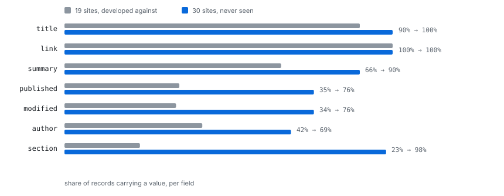

## Measured

Extraction is judged on live corpora rather than on fixtures, and re-measured
after every change to inference. There are three: 808 pages from 19 news sites
in English, Greek, Russian and French; ten live RSS and Atom feeds; and a
second, larger HTML corpus of 1,267 pages from 30 different sites, kept
deliberately separate so it can answer a question the first cannot.

Per field, how many of the extracted records carry a value, and how many
distinct values those are. Distinctness is the number that matters: a field
whose value is the same on every page of a site is describing the site, not the
article.

### 808 HTML pages, 19 sites

| Field | Before | After | What it had found |
| --- | --- | --- | --- |
| records | 503 | **713** | |
| title | 243 / 10 | **644 / 627** | the site's name, one per site |
| link | 77 / 4 | **713 / 700** | preconnect hints naming CDNs |
| author | 0 | **301 / 52** | nothing at all |
| published | 224 / 74 | **249 / 204** | |
| summary | 470 / 470 | 473 / 470 | og:description, already correct |
| section | 1 / 1 | **166 / 19** | a related-articles heading |

### Ten live feeds

| | Records |
| --- | --- |
| Before | 9 |
| After | **266** |

### 1,267 pages, 30 sites the model has never seen

The first corpus is the one the work was done against, so its numbers say only
that the faults found in it were fixed. This one is thirty different sites,
sharing no host with the first, in Arabic, Turkish, Spanish, Malayalam and
English. Nothing was tuned against it.

| Field | 19 sites, developed against | 30 sites, unseen |
| --- | --- | --- |
| title | 90% | **100%** |
| link | 100% | 100% |
| summary | 66% | **90%** |
| published | 35% | **76%** |
| modified | 34% | **76%** |
| author | 42% | **69%** |
| section | 23% | **98%** |

867 records from 1,267 pages. Every field is filled more often on the sites the
algorithm had never seen than on the ones it was built against, which is the
opposite of what overfitting looks like.

What it exposed, and what came of it:

- **The CSS dialect pinned a per-page id.** `#asset-59da10e1-...` led the
  selector for `published` and `modified`, so the rule matched exactly the page
  it was induced from, while the XPath for the same field stayed generic and
  worked across 660 records. *Fixed.* Where a group's instances share no leading
  segment, the selector generalizes to the tail they do share, which CSS already
  reads as descendant-anchored. Re-inducing both corpora changes no extraction
  number and removes the id.

- **`published` and `modified` were thought to be one node.** They are not. The
  locators are `dateCreated` and `dateModified`, distinct and correct, and 273
  of the 660 records carrying both hold *different* values, which could not
  happen if one node fed them. The 387 that agree are articles that were never
  edited. *Not a fault.*

- **118 of 867 titles are shorter than twenty characters**: `"Page A1"`,
  `"Ads"`, `"Community"`. Most are distinct rather than one section name
  repeated, so this is a mix of section pages read as articles and titles that
  really are that short. *Open*, and the reason `internal/classify` exists.

### What the corpora exposed

Every one of these was found by running against live data and measuring, not by
reading the code:

| Fault | Effect |
| --- | --- |
| A field's location was fixed before the record's container was known | A feed's logo beat the article; 45 articles became 1 |
| The container was always the deepest ancestor | It was `/html/head` on every site, so the article's own markup was never a candidate |
| Support counted matches, not independent observations | A locator was rewarded for being ambiguous |
| Reach did not count at all | A body div on one site beat a meta tag on thirteen |
| HTML tag names were discarded as labels | `<h1>` is on 13/13 sites and `<time>` on 10/13, both ignored |
| An attribute's own name was a full-weight label | `<link rel="alternate" title="...">` outscored the headline |
| `rel` was never read as a label | `rel="canonical"` unused despite 10/13 sites at perfect precision |
| Layout classes were read as labels | `class="text-3xl"` and `class="brand"` named fields |
| The sequence model averaged a distribution into a confidence | Every score fell by about a third, and further as the schema grew |
| A value that never changed was still read as a field | `section` was one heading repeated on 211 records |

The last of those is worth stating on its own, because no amount of reading the
markup finds it. `section` resolved to
`
Other items that may interest you
`, and `kicker` is a
real name for a section line, so the label was correct. What marked it was that
211 records shared one value. A field describes its record and so changes from
one to the next; a value that never changes is describing the site.

Every field is filled more often on the sites the algorithm had never seen than
on the ones it was built against, which is the opposite of what overfitting
looks like.

These numbers are re-measured after every change to inference, against the same
two corpora, and the [engine documentation](engine.html) explains why they are
not configuration.
